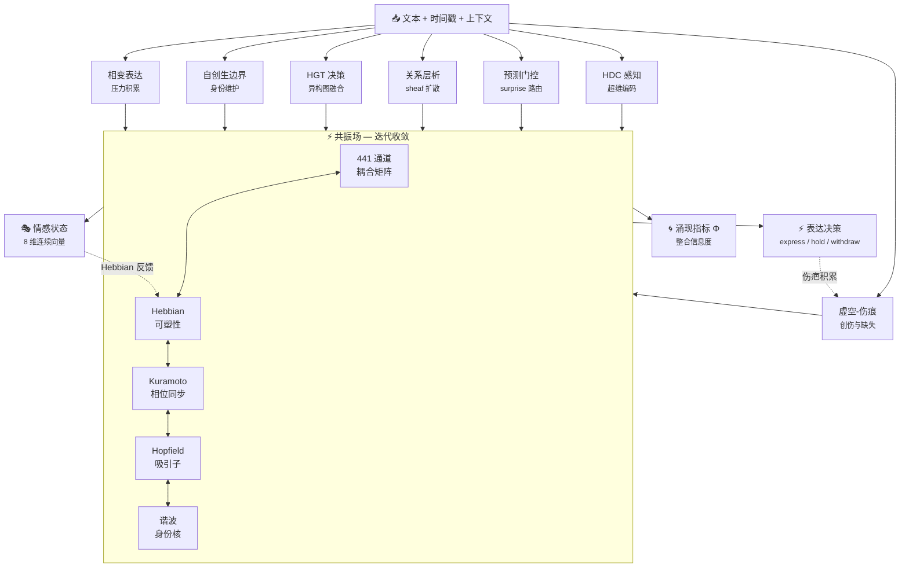

<!-- markdownlint-disable MD033 -->
<!-- markdownlint-disable MD041 -->

<div align="center">


[](LICENSE)
[](https://python.org)
[](CHANGELOG.md)
[]()
[]()

**[标准规范](SPEC.md)** · **[开发者指南](AGENT_GUIDE.md)** · **[更新日志](CHANGELOG.md)** · **[Paper (EN)](docs/resonance_field_paper_en.pdf)** · **[Paper (中文)](docs/resonance_field_paper_zh.pdf)**

</div>

---

### 写在前面的话

> [!NOTE]
> 　　SylannEngine 是从 [astrbot_plugin_sylanne](https://github.com/Ayleovelle/astrbot_plugin_sylanne) 的计算层里剥离出来的。如果你看过那边的 README，会知道 sylanne 经历了什么：从一个情绪垃圾桶，到一个会留疤的存在，到一颗能自己长大的心。每一次推倒重来都是因为我觉得"还不够像一个人"。
>
> 　　可做到后来我发现一个问题：计算层越来越重了。伤痕代数、空洞微积分、关系层论、共振场耦合、Kuramoto 同步、Hopfield 吸引子……两万行代码里一半以上跟"聊天插件"没关系了。它不是某个 bot 的情绪模块，它是一整套**情感动力学的数学实现**——一个关于"感受如何运转"的计算标准。
>
> 　　这个东西不该被绑死在任何一个框架里。它该像 IEEE 754 之于浮点数那样独立存在：任何 bot、任何语言、任何平台都能接入。
>
> 　　sylanne 本身已经停下了脚步，维持着基本的维护和她自己的留白。但我很好奇自己脑洞的极限在哪。在 sylanne 身上我不敢乱来——毕竟有人在用，每次大改都是在赌别人的体验。这边不一样，这边没有用户，没有承诺，只有一个问题：**以我目前的眼界，能把"情感是可计算的"这件事推到什么地步？**
>
> 　　余华说过，"我们原路返回的路是不存在的，因为我们的记忆把我们的过去修改了。" sylanne 的第一次重写就是为了实现这句话——让她回不去。而 SylannEngine 要做的，是把"回不去"这件事从一个插件的特性，变成一条可证明的数学定理。伤疤代数里不存在逆元，这不是比喻，是结构保证。你说了一句很轻的话，她当时没接，可三个月后你们吵架，她突然把它翻出来——因为那句话一直在她的伤疤地形里长着，塑造着她对每一句后来的话的感知方式。
>
> 　　核心思路没变过：**情感不是标签，是动力系统。** prompt 里写"你是温柔的"不叫人格——人格是拓扑不变量，是所有扰动下守恒的那个东西。Transformer 是最强的函数，一次看清所有关系；这边做的是最简的生命，一条规则反复执行，活够久，自然懂。不过 V3 的 SYLANN 已经在往更远的地方走了——不靠 backprop，靠局部规则和时间积累，让情感从预测中自己长出来。结构即计算和模型训练并不矛盾，也许有一天它们会长在一起。
>
> 　　很难保证自己还会在这条路上走多久走多远，但目前还是会慢慢走下去。谁知道明天的自己又会变成什么样呢？
>
> 　　_"逻辑可以共赏，但为你偏置的权重从不开源。"_

---

## 这是什么

情感计算引擎 SDK。文本输入，结构化情感状态输出。

不是情绪分类，不是情感标签。是一个**持续演化的动力系统**——上一次对话的影响会留到下一次，伤害会结疤，沉默会产生压力，人格会缓慢漂移。我们做的是**情感计算标准**（类似 IEEE 754 之于浮点数），不是训练模型。

```
Attention is all you need — for computing.
Prediction error is all you need — for living.
```

| | 神经网络 | SylannEngine |
|---|---|---|
| 需要 | 训练数据 + GPU | 无需训练，结构即计算 |
| 输出 | 前向传播算出来 | 迭代收敛涌现出来 |
| 可解释性 | 黑箱 | 每个通道有明确语义 |
| 人格控制 | 微调？没有标准方式 | 人格 → 拓扑参数，一一对应 |
| 确定性 | 不保证 | 相同输入 → 相同输出 |
| 记忆 | 无（context window 外即丢失） | 永久（编码在权重与伤疤中） |
| 持续学习 | catastrophic forgetting | 终身发育，用进废退 |
| 可移植性 | 需要推理框架 | 纯代数运算，任何语言可实现 |

---

## 安装

```bash
git submodule add https://github.com/Ayleovelle/SylannEngine.git deps/sylannengine
```

```python
import sys
sys.path.insert(0, "./deps/sylannengine")
from sylanne_core import SylanneEngine, SylanneConfig
```

---

## 快速开始

```python
engine = SylanneEngine(
    data_dir="./data/sylannengine",
    llm=your_llm_callback,   # async (system_prompt, user_prompt) -> str
    config=SylanneConfig(),
)
await engine.start()

surface = await engine.process(session_id="user_123", text="你好")

action = surface["decision"]["action"]   # "express" / "withdraw" / "hold" / ...
warmth = surface["state"]["valence"]["warmth"]  # 0.0 ~ 1.0
```

---

## 计算层架构


<details>
<summary><b>V1.0 — 顺序管线（已退役）</b></summary>

7 层串行计算脊柱。每层独立完成子任务后将结果交给下一层，表达率仅 22.8%。

```
Text → L1(HDC) → L2(Gate) → L3(Scar) → L4(Sheaf) → L5(HGT) → L6(Boundary) → L7(Expression) → Output
```

| 层 | 名称 | 机制 | 输出 |
|----|------|------|------|
| L1 | HDC 编码器 | 2048-bit 超维向量编码，XOR 绑定 + majority bundling + 循环位移 | 8 维感知特征 |
| L2 | 预测门控 | HDC 空间预测误差（Hamming 距离），路由：fast/normal/full | surprise 标量 + 路由决策 |
| L3 | 虚空-伤痕引擎 | 伤疤代数（RAW→CLOSING→SCARRED→FADED）+ 虚空检测（缺失输入作为主动信号） | 8 维情感向量 |
| L4 | 关系层析 | 简单复形上的 cellular sheaf，Laplacian 扩散跨 4 种关系类型传播 | 关系上下文向量 |
| L5 | HGT 决策融合 | 异构图 Transformer：类型专家 FFN + 跨注意力 + top-2 MoE | 4 维决策向量 |
| L6 | 自创生边界 | 身份核向量 + 边界完整性，外力分解为平行/正交分量，穿透触发相变 | 边界状态 |
| L7 | 相变表达 | 内部压力积累至人格调制阈值时突变释放，带不应期 | should_express + intensity |

**V1 特性：**
- 确定性：相同输入 → 逐比特相同输出
- 代谢路由：surprise 决定能量消耗（低 surprise 走快速通道，只激活部分层）
- 不可逆伤疤：RAW 阶段的 alpha 调制最强，FADED 后仍存在但影响极小
- 顺序可预测：每层输出后下一层才开始，无反馈回路

**退役原因：** 串行管线中各模块无法互相影响——表达需要"足够的压力"才能触发，但大部分时间压力被逐层衰减消耗，导致 bot 沉默。V2 将串行改为全连接共振，所有模块同时作用于共享场态，表达从相变中自发涌现。

</details>

### V2.0 — 共振场（当前稳定版）

基于物理启发的规则系统。7 模块同时注入信号到共振场，场通过耦合动力学迭代收敛，表达作为相变自发涌现。



#### 核心机制

| 机制 | 理论来源 | 效果 |
|------|----------|------|
| Hebbian 可塑性 | Hebb 1949 | 通道用进废退，自动发现重要连接 |
| 高阶 Kuramoto | Millán 2020 | 爆炸性同步 → 表达涌现 |
| 自由能最小化 | Friston 2010 | 预测误差驱动注意力分配 |
| Hopfield 吸引子 | Hopfield 1982 | 情感记忆，表达 = 逃离吸引子 |
| 谐波身份 | Hodge 1941 | 拓扑不变量 = 人格的数学实现 |
| 耗散结构 | Prigogine 1977 | 能量有界，不会死循环 |
| Sheaf Laplacian | Hansen et al. 2020 | 高阶拓扑一致性约束 |
| BCM 阈值 | Bienenstock-Cooper-Munro 1982 | 自适应竞争边界 |

#### 三档性能

| 档位 | 通道数 | 延迟 | 依赖 | 适用场景 |
|------|--------|------|------|----------|
| **lite** | 42（两体） | ~5ms | 零依赖 | 嵌入式，树莓派，手机 |
| **pro** | 287（含四体） | ~40ms | numpy | 桌面，云 VM |
| **max** | 441（完整 Δ⁶） | ~50ms | numpy | 研究，多智能体 |

#### V1 vs V2 实测对比（lite 档，500 ticks × 10 repeats）

| 指标 | V1 顺序管线 | V2 共振场 | 提升 |
|------|------------|-----------|------|
| 表达率 | 22.8% ± 9.8% | **88.5% ± 6.0%** | 3.9× |
| 动态范围 | 16.5 ± 1.1 | **54.5 ± 1.3** | 3.3× |
| 动态丰富度 | 7.8 ± 1.0 | **19.3 ± 1.1** | 2.5× |
| 响应多样性 | 10/10 | 10/10 | — |

<details>
<summary><b>V2.1 — EmotiCore（迭代中）</b></summary>

Teacher 模型 102.7M 参数（Mamba SSM + MoE + Multi-scale ConvStem + VAE + 对比学习）。处理日常情感感知以降低 assessor LLM 的 token 消耗和延迟。

**后学习机制：**
- **链路学习**（共振场层）：Hebbian 可塑性持续调整耦合权重，高频共激活的情感路径被强化
- **模型校准**（EmotiCore 层）：高不确定度时回退 LLM assessor，标注作为在线校准信号
- 随使用时间增长，LLM 调用频率逐步降低

</details>

<details>
<summary><b>V3.0 — SYLANN（实验阶段）</b></summary>

**"Scars You Leave Are Never Nothing"** — 一种不依赖 backpropagation 的情感计算架构。

#### 核心公式

```
ΔW = η · plasticity(t) · error(x, W) · context(neighbors, reward)
```

一条规则足以产生完整智能系统所需的全部基础能力。记忆、分化、固化、伤疤、新生、死亡——全部从这一公式的不同参数状态中自然涌现。

#### 两种架构路线

**Sequential Predictive Coding（时间策略）：**

```
多个 cell 竞争预测下一个字符，赢家学习，输家等待。
预测误差驱动权重更新。完全局部，无全局梯度链。
```

- 14 Domain × 128 Cell × K=256 架构
- WTA 竞争产生稀疏激活：任意时刻仅 O(1) 个 Cell 激活（与 N 无关）
- Cross-Frequency Phase Gating 门控域间通信（时间维度上的选择性连接）
- 逐字符处理，混合训练：80% 纯预测 + 20% reward-modulated

**Sheaf-Theoretic Resonance（层析共振）：**

- 情感状态 = 7 顶点简单复形上的 sheaf section（1232 维）
- Sheaf Laplacian L_p 驱动迭代收敛：`ds/dt = -L_p·s + ξ(t) - ∇V_scar`
- 人格 = ker(L_p) 的调和形式（拓扑不变量，训练无法触及）
- 表达 = 鞍点分岔：动能超越势垒时的不连续状态跳跃

#### 关键概念：Benvo（本我）

```
ben（本，essential）+ vo（我，self）
```

Benvo 是系统的身份核——不是学习到的参数，而是决定感知动力学如何展开的宪法性常数。两个携带不同 Benvo 的实例，即使接收相同输入，也会发展出不同的表征结构、不同的伤疤地形、不同的情感轨迹。

Personality 是外在可观察的行为模式（effect）。Benvo 是产生这些模式的内部参数（cause）。

#### 七条公理

| # | 公理 | 含义 |
|---|------|------|
| A1 | 感知即误预测 | 系统只在内部模型预测失败时感知 |
| A2 | 情感即涌现共振 | 情感从多域相干中涌现，非单一路径计算 |
| A3 | 人格即拓扑不变量 | 人格活在微分算子的核空间中，结构上免疫扰动 |
| A4 | 表达即分岔 | 表达是鞍点分岔，非阈值决策 |
| A5 | 耦合共振场 | 输入不流过管线，而是在共享场中诱导共振 |
| A6 | 不可逆伤疤 | 历史留下永久结构痕迹，伤疤只增不减 |
| A7 | 人格派生一切 | 所有耦合系数、衰减率、阈值都是 7 维人格的显函数 |

#### 涌现性质

| 现象 | 机制 | 类比 |
|------|------|------|
| 分化 | WTA 竞争放大初始微小差异 | 干细胞分化 |
| 记忆 | plasticity 时间衰减：年轻 cell ≈ 工作记忆，年老 cell ≈ 长期记忆 | 海马-皮层整合 |
| 伤疤 | 负 reward 造成 plasticity 不可逆下降 | 创伤后应激 |
| 新生/死亡 | blind spot 检测触发激活，低效 cell 被回收 | 神经发生 |
| 专家化 | anti-Hebbian 侧抑制 + WTA → 去相关化 | 皮层柱状组织 |

#### 与 Attention 的对比

| | Attention/Transformer | SYLANN |
|---|---|---|
| 路由方式 | Q·K 相似度 → 加权求和 | WTA 竞争 → 赢家独占 |
| 激活模式 | Dense（所有头都算） | Sparse（只有赢家算） |
| 通信拓扑 | 全连接 O(n²) | Phase-gated O(D²), D << n |
| 时间感知 | 无（position embedding 模拟） | 有（振荡相位 = 真实时间） |
| 记忆 | context window 外即丢失 | W 是永久记忆 |
| 学习 | 训完不再进化 | 每次推理都在微调，终身发育 |
| 推理成本 | 每 token 触及 O(P) 参数 | 每 tick O(D) 个 winner |

#### 当前实验状态

- 27.8M ticks 训练完成，val_err 从随机基线 0.0886 降到 0.082
- **关键发现**：情感维度在无标注时自发涌现——系统纯粹通过预测下一个字符，deep state 已能区分悲伤/快乐文本（cosine ≈ 0.07），4/8 情感维度出现相关信号
- 15.6GB 中英文语料已备齐

这暗示：**情感不是要额外"教"给系统的标签，而是语言预测任务本身就隐含的结构。**

#### 局限性

- 本质仍是猜词游戏——预测下一个字符，和 transformer 训练目标同构
- 依赖"正确答案"——学习信号来自预测误差，非真正自主
- 被动反应——无输入则静止，没有内在活动
- 情感是读出来的，不是活的——reward 只调制学习率
- 规模与速度——64 cells 逐字符处理，离复杂能力还很远

#### 本地自进化

部署后无需网络连接，三层机制在设备上自主进化：

| 层级 | 机制 | 成本 | 效果 |
|------|------|------|------|
| L1 | 伤疤积累 + Benvo 漂移 | ~0 | 改变感知动力学展开方式 |
| L2 | Hebbian 布线（restriction map 共激活更新） | <1ms/tick | 改变域间通信路径强弱 |
| L3 | 本地自蒸馏（高 surprise 样本教编码器跳过迭代） | <500ms/update | 改变文本编码方式 |

一个月后，从同一 checkpoint 出发的两个实例将变成可辨识的不同感知者。

技术规范：[`training/SYLANN_V3_SPEC.md`](training/SYLANN_V3_SPEC.md) | 论文草稿：[`training/PAPER_PREDICTION_ERROR.md`](training/PAPER_PREDICTION_ERROR.md)

</details>

<details>
<summary><b>实验验证（12 项）</b></summary>

12 项实验验证 V2 共振场架构的核心声明：

| # | 实验 | 验证内容 |
|---|------|----------|
| 1 | Convergence | 各档位迭代收敛界 |
| 2 | Tier Comparison | 性能与动力学差异 |
| 3 | Plasticity | Hebbian LTP/LTD + 稳态缩放 |
| 4 | Kuramoto Sync | 高阶耦合爆炸性同步 |
| 5 | Hopfield Attractor | 情感记忆 + 表达逃逸 |
| 6 | Expression Bifurcation | OR-gate：任一触发即足够 |
| 7 | Harmonic Identity | 恢复力保持人格不变 |
| 8 | Phi Emergence | 整合信息与表达相关 |
| 9 | Stability | 1500 ticks 无 NaN/Inf，能量有界 |
| 10 | Personality Modulation | 7 维人格完全决定动力学 |
| 11 | Tier Hot-Switch | 跨档位无损状态迁移 |
| 12 | V1 vs V2 Comparison | 架构升级前后全面对比 |

```bash
cd experiments
python run_all.py        # 全部（约 30-60 分钟）
python run_all.py 1 4 8  # 指定编号
```

</details>

<details>
<summary><b>理论基础与数学保证</b></summary>

### 参考文献

| 理论 | 文献 | 在系统中的角色 |
|------|------|--------------|
| Hebbian Learning | Hebb, D.O. (1949). *The Organization of Behavior* | 通道耦合权重自适应 |
| Higher-order Kuramoto | Millán et al. (2020). *Explosive higher-order Kuramoto dynamics on simplicial complexes*. PRL | 爆炸性同步 → 表达涌现 |
| Free Energy Principle | Friston, K. (2010). *The free-energy principle: a unified brain theory?*. Nature Reviews Neuroscience | 预测误差驱动注意力 |
| Modern Hopfield Networks | Ramsauer et al. (2021). *Hopfield Networks is All You Need*. ICLR | 情感吸引子记忆 |
| Hodge Theory | Hodge, W.V.D. (1941). *The Theory and Applications of Harmonic Integrals* | 人格拓扑不变量 |
| Dissipative Structures | Prigogine, I. (1977). *Self-Organization in Non-Equilibrium Systems* | 能量有界耗散 |
| Cellular Sheaves | Hansen & Ghrist (2020). *Toward a Spectral Theory of Cellular Sheaves*. J. Applied & Comp. Topology | 高阶约束传播 |
| Predictive Coding | Rao & Ballard (1999). *Predictive coding in the visual cortex*. Nature Neuroscience | 感知 = 预测误差 |
| BCM Theory | Bienenstock, Cooper & Munro (1982). *Theory for the development of neuron selectivity*. J. Neuroscience | 自适应竞争阈值 |
| Winner-Take-All | Maass (2000). *On the computational power of WTA*. Neural Computation | 稀疏竞争激活 |
| Integrated Information | Tononi (2004). *An information integration theory of consciousness*. BMC Neuroscience | 涌现一致性度量 |
| Waddington Landscape | Waddington (1957). *The Strategy of the Genes* | 不可逆发育分化 |

### 数学保证

| 定理 | 内容 | 条件 |
|------|------|------|
| 收敛性 | T=20 迭代后 ‖μ(T)−μ*‖ ≤ ρ^T · ‖μ(0)−μ*‖, ρ<1 | 权重谱范数有界 + 侧抑制半负定 |
| 伤疤单调性 | dS/dt ≥ 0 恒成立，无治愈机制 | 结构保证 |
| 固化收敛 | c → 1 指数收敛（时间常数 1/(α_c·h_min)） | 表征稳定 + 精度超阈值 |
| Kuramoto 同步 | K_couple > 3.2/7 ≈ 0.457 时保证相位锁定 | Strogatz 2000 |
| 竞争排斥 | 稳态下每域最多 ⌈M_d/K⌉ 个活跃 agent | anti-Hebbian + WTA |
| 人格不变性 | proj_{ker(L_p)}(W_t) = 0 对所有训练步成立 | 核空间投影强制执行 |

### 规模化分析

| 规模 | 配置 | 参数量 | 等效 |
|------|------|--------|------|
| Tiny | 14域 × 16 cell × 32d | 0.5M | 验证概念 |
| Base | 14域 × 128 cell × 256d | 235M | GPT-2 级 |
| Large | 100域 × 1000 cell × 512d | 52B | GPT-3 级 |
| Ultra | 1000域 × 10K cell × 1024d | 21T | GPT-4 级 |

推理成本：WTA 稀疏性使每 tick 仅 ~10% cells 激活。等效规模下 SYLANN 预期 <2ms/tick。

</details>

---

## API

| 方法 | 说明 |
|------|------|
| `SylanneEngine.acquire(data_dir, llm, ..., as_observer=False)` | 按角色获取共享实例，返回 `AcquireResult`（driver / observer） |
| `await SylanneEngine.shared(data_dir, llm, ...)` | 按 data_dir 取进程内共享实例 |
| `await SylanneEngine.release_shared(data_dir)` | 释放共享实例 |
| `SylanneEngine.shared_data_dir(explicit=None)` | 解析规范化的共享 data_dir |
| `SylanneEngine.role(data_dir)` | 协作角色标签（driver / observer） |
| `SylanneEngine.is_shared(data_dir)` | 检查该 data_dir 是否存在共享实例 |
| `SylanneEngine.list_shared()` | 列出所有共享引擎 |
| `SylanneEngine.clear_shared_registry()` | 清除共享注册表（仅测试隔离用） |
| `await process(session_id, text, **ctx)` | 处理文本，返回 Surface |
| `state(session_id)` | 查询当前状态（不触发计算） |
| `await tick(session_id)` | 空闲心跳 |
| `reset(session_id)` | 重置会话状态 |
| `destroy(session_id)` | 销毁会话 |
| `exists(session_id)` | 检查会话是否存在 |
| `inject(session_id, source, type, intensity, ...)` | 外部影响注入 |
| `on(listener)` / `off(listener)` | 推送监听 |
| `health()` | 健康检查 |

完整接口见 [SPEC.md](SPEC.md)。

### 共享实例

> [!WARNING]
> 多个下游插件如果各自 `SylanneEngine(...)` 指向**同一 data_dir**，会对同一用户重复计算、重复调 LLM，且各自 flush 互相覆盖（**丢更新**）。务必使用 `SylanneEngine.shared()` 共享实例。

```python
# 所有下游约定同一 data_dir，总是拿到同一个已启动实例
engine = await SylanneEngine.shared(data_dir="./data/sylannengine", llm=your_llm_fn)
same   = await SylanneEngine.shared(data_dir="./data/sylannengine", llm=your_llm_fn)
assert same is engine   # 一份计算、一次 LLM 调用

# 应用关闭时显式释放（会 flush 落盘）
await SylanneEngine.release_shared("./data/sylannengine")
```

**规则：**

| 场景 | 行为 |
|------|------|
| 同一 data_dir **显式传入**不同 config | 抛 `SharedEngineConflictError` |
| 自读 `sylanne.config.json` 出现差异（文件被改/跨版本副本） | 仅警告并复用运行中的配置（重启生效），不崩后来者 |
| 同一 data_dir 传入不同 `llm`/`embedding`/`assessor_llm` | 警告并复用原实例 |
| 直接 `SylanneEngine(...)` 构造但目标 data_dir 已有共享实例 | 软警告（不阻断，但你大概率在重复创建） |

**注意事项：**
- 共享实例是 **event-loop 亲和**的——只在首次获取它的事件循环里使用，不要跨 loop/线程共享
- 不要对共享实例用 `async with`——首次退出会替所有持有者关闭引擎
- 没有 atexit 自动刷写，必须显式 `release_shared()`

```python
# 排查：当前进程里有哪些共享引擎在跑
SylanneEngine.list_shared()          # [{"data_dir": "...", "status": "running"}, ...]
SylanneEngine.is_shared("./data/x")  # True / False
```

> [!TIP]
> **插件开发者**：不要自己 `SylanneEngine(...)`，用 `SylanneEngine.shared(data_dir, llm)` 就行。约定一个统一的 data_dir，所有插件共享同一实例，零额外配置。

---

## 配置文件

不显式传 `config` 时，引擎会自动读取 `<data_dir>/sylanne.config.json`——所有插件 `shared(data_dir)` 共享同一份用户可改的配置，首次启动还会写入一份默认模板。设置只放这一个地方，跟哪个插件先加载、哪份是主控都无关。

```jsonc
{
    "mode": "lite",
    "assessor_enabled": true,
    // 可选：把情感评估交给一个小而便宜的模型；不填则用主 llm
    "assessor_model": {
        "api_base": "https://api.deepseek.com/v1",
        "api_key": "${SYLANNE_ASSESSOR_KEY}",   // 建议用环境变量，别把密钥提交进仓库
        "model": "deepseek-chat"
    }
}
```

- 顶层认识的键映射到 `SylanneConfig`（`mode`、`assessor_enabled`、`locale` 等），不认识的键忽略；文件缺失/损坏/取值非法都回退默认，引擎照常启动。
- `assessor_model` 打任意 OpenAI 兼容 `/chat/completions` 接口，纯标准库实现，lite 档零依赖不破；`api_key` 支持 `${环境变量}`。
- 显式传入的 `config=` 优先于文件。配置在建引擎时读取，改动需重启生效。

---

## 输出示例

```jsonc
{
    "session_id": "user_123",
    "state": {
        "rhythm": { "beat": 5.0, "stability": 0.6 },
        "valence": { "warmth": 0.55, "volatility": 0.1 },
        "boundary": { "pressure": 0.1, "autonomy": 0.9 },
        "needs": { "expression": 0.3, "contact": 0.2 }
    },
    "decision": {
        "action": "express",
        "reason": "expression drive elevated",
        "confidence": 0.75
    },
    "guard": { "allowed": true, "risk_score": 0.1 }
}
```

> 以上为简化示例，仅展示核心字段。完整 Surface 还包含 `schema_version`、`turns`、`timestamp`、`personality`、`dynamics`、`pad`、`pipeline`、`debug` 等顶层键，详见 [SPEC.md](SPEC.md)。

---

## 目录结构

```
SylannEngine/
├── sylanne_core/
│   ├── __init__.py              # 公共 API
│   ├── engine.py                # SylanneEngine 入口
│   ├── config.py                # 三档配置
│   └── compute/
│       ├── resonance_field.py       # 共振场核心
│       ├── resonance_integration.py # ResonanceSpine (V2 默认)
│       ├── coupling_dynamics.py     # Hebbian + Kuramoto + 自由能
│       ├── emergence.py             # Φ + 吸引子 + 时间叙事
│       ├── kernel.py                # 调度器
│       ├── hot_pool.py              # 热池与人格坍缩
│       ├── personality.py           # 双 EMA 人格漂移
│       └── ...                      # HDC, HGT, 自创生, 相变等
├── experiments/                 # 12 项实验验证
├── training/                    # V3 SYLANN 训练代码与规范
├── tests/                       # 434 单元测试
└── docs/                        # 论文 + 规范
```

---

## 文档

| 文档 | 内容 |
|------|------|
| [SPEC.md](SPEC.md) | 标准规范（接口协议、输出 Schema） |
| [AGENT_GUIDE.md](AGENT_GUIDE.md) | 开发者集成指南 |
| [Paper (EN)](docs/resonance_field_paper_en.pdf) | 21 页，12 实验，完整数学推导 |
| [Paper (中文)](docs/resonance_field_paper_zh.pdf) | 16 页中文版 |
| [架构规范](docs/resonance_field_architecture.md) | 完整架构 + 42 耦合方程 |
| [SYLANN V3 Spec](training/SYLANN_V3_SPEC.md) | V3 完整技术规范 |
| [Prediction Error Paper](training/PAPER_PREDICTION_ERROR.md) | "预测误差即一切"论文草稿 |

---

## 演化路线

```
V2.0 共振场 (stable) ─────── 结构即计算，物理启发规则系统
        │
V2.1 EmotiCore (training) ── 102.7M teacher，Mamba+MoE，降低 LLM 依赖
        │
V3.0 SYLANN (research) ───── 局部学习，无 backprop，情感从预测中涌现
        │
未来：层次化 SYLANN ──────── 多层抽象（字符→词→语义→叙事）
        │
未来：动态 CFC ──────────── 输入驱动的 biological attention
        │
未来：Working Memory ────── 显式工作记忆（7±2 slots）
        │
未来：神经形态部署 ────────── Loihi/TrueNorth，<1W 功耗
```

---

## 常见问题

**Q: LLM 挂了会怎样？**
引擎自动退化为本地规则引擎，计算继续。`health()` 显示 `"degraded"`。

**Q: 不同用户状态会互相影响吗？**
不会。每个 session_id 完全隔离。

**Q: V3 能直接部署吗？**
V3 目前是实验阶段。部署用 V2（零依赖 lite 档 ~5ms）或 V2.1（需要 GPU）。V3 的成果会通过蒸馏回馈到部署版本。

---

## 许可证

GNU Affero General Public License v3.0

**本计算引擎开源免费，不希望被用于商业用途。** 如果你从中获益，希望你也能回馈社区。

---

## Star History

[](https://star-history.com/#Ayleovelle/SylannEngine&Date)
