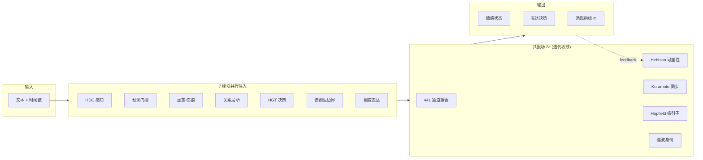

<!-- markdownlint-disable MD033 -->
<!-- markdownlint-disable MD041 -->


<p align="center">
  
  
  
  
</p>

<p align="center">
  <a href="SPEC.md"><strong>📐 标准规范</strong></a> ·
  <a href="AGENT_GUIDE.md"><strong>🤖 开发者指南</strong></a> ·
  <a href="CHANGELOG.md"><strong>📋 更新日志</strong></a> ·
  <a href="docs/resonance_field_paper_en.pdf"><strong>📄 论文 (EN)</strong></a> ·
  <a href="docs/resonance_field_paper_zh.pdf"><strong>📄 论文 (中文)</strong></a>
</p>

---

## 这是什么

情感计算引擎 SDK。文本输入，结构化情感状态输出。为 AstrBot 插件提供"AI 现在是什么情绪、接下来想做什么"的计算服务。

不是情绪分类，不是情感标签。是一个**持续演化的动力系统**——上一次对话的影响会留到下一次，伤害会结疤，沉默会产生压力，人格会缓慢漂移。

---

## 安装

**AstrBot 插件开发者**（推荐）：WebUI → 插件 → 从 Git 仓库安装：

```
https://github.com/Ayleovelle/SylannEngine.git
```

**SDK 独立使用**：

```bash
git clone -b sdk https://github.com/Ayleovelle/SylannEngine.git sylanne_sdk
```

---

## 30 秒上手

```python
from sylanne_core import get_engine

engine = get_engine()  # 插件版：前置插件已配置好 LLM
surface = await engine.process(session_id="user_123", text="你好")

action = surface["decision"]["action"]   # "express" / "withdraw" / "hold" / ...
warmth = surface["state"]["valence"]["warmth"]  # 0.0 ~ 1.0
should_speak = surface["decision"]["action"] == "express"
```

---

## V2 共振场架构

V1 是顺序管线（L1→L2→...→L7），表达率仅 22.8%——bot 大部分时间沉默。

V2 是**全连接共振网络**——7 个模块同时注入信号到共振场，场通过耦合动力学迭代收敛，表达作为相变自发涌现。表达率 88.5%，动态范围 3.3×。



### V1 vs V2 实测对比（lite 档，500 ticks × 10 repeats）

| 指标 | V1 顺序管线 | V2 共振场 | 提升 |
|------|------------|-----------|------|
| 表达率 | 22.8% ± 9.8% | **88.5% ± 6.0%** | 3.9× |
| 动态范围 | 16.5 ± 1.1 | **54.5 ± 1.3** | 3.3× |
| 动态丰富度 | 7.8 ± 1.0 | **19.3 ± 1.1** | 2.5× |
| 响应多样性 | 10/10 | 10/10 | — |

升级后 bot 从"大部分时间沉默"变成"积极表达"，无需改任何配置。

---

## 三档性能

| 档位 | 通道数 | 延迟 | 依赖 | 适用场景 |
|------|--------|------|------|----------|
| **lite** | 42（两体） | ~5ms | 零依赖 | AstrBot 默认，树莓派，手机 |
| **pro** | 287（含四体） | ~40ms | numpy | 桌面，云 VM |
| **max** | 441（完整 Δ⁶） | ~50ms | numpy | 研究，多智能体 |

插件版锁定 lite 档。SDK 版可自由切换：`engine.switch_tier("pro")`。

---

## 核心机制

| 机制 | 理论来源 | 效果 |
|------|----------|------|
| Hebbian 可塑性 | Hebb 1949 | 通道用进废退，系统自动发现重要连接 |
| 高阶 Kuramoto | Millán 2020 | 爆炸性同步 → 表达涌现 |
| 自由能最小化 | Friston 2010 | 预测误差驱动注意力分配 |
| Hopfield 吸引子 | Hopfield 1982 | 情感记忆，表达 = 逃离吸引子 |
| 谐波身份 | Hodge 1941 | 拓扑不变量 = 人格的数学实现 |
| 耗散结构 | Prigogine 1977 | 能量有界，不会死循环 |

---

## 输出示例

```jsonc
{
    "session_id": "user_123",
    "state": {
        "rhythm": { "beat": 5.0, "stability": 0.6 },
        "valence": { "warmth": 0.55, "volatility": 0.1 },
        "boundary": { "pressure": 0.1, "autonomy": 0.9 },
        "needs": { "expression": 0.3, "contact": 0.2 }
    },
    "decision": {
        "action": "express",
        "reason": "expression drive elevated",
        "confidence": 0.75
    },
    "guard": { "allowed": true, "risk_score": 0.1 }
}
```

---

## API

| 方法 | 说明 |
|------|------|
| `get_engine()` | 获取插件版共享实例 |
| `await process(session_id, text, **ctx)` | 处理文本，返回 Surface |
| `await tick(session_id)` | 空闲心跳 |
| `feedback(session_id, "accepted"/"rejected")` | 反馈调制可塑性 |
| `inject(session_id, source, type, intensity)` | 外部影响注入 |
| `on(listener)` / `off(listener)` | 推送监听 |
| `health()` | 健康检查 |
| `exists(session_id)` | 会话是否存在 |

完整接口见 [SPEC.md](SPEC.md)。

---

## 为什么不用神经网络

| | 神经网络 | 共振场 |
|---|---|---|
| 需要 | 训练数据 + GPU | 无需训练，结构即计算 |
| 输出 | 前向传播算出来 | 迭代收敛涌现出来 |
| 可解释性 | 黑箱 | 每个通道有明确语义 |
| 人格控制 | 微调？没有标准方式 | 人格 → 拓扑参数，一一对应 |
| 确定性 | 不保证 | 相同输入 → 相同输出 |
| 可移植性 | 需要推理框架 | 纯代数运算，任何语言可实现 |

我们做的是**计算标准**（类似 IEEE 754），不是训练模型。

---

## 目录结构

```
SylannEngine/
├── sylanne_core/
│   ├── __init__.py              # 公共 API
│   ├── engine.py                # SylanneEngine 入口
│   ├── config.py                # 三档配置
│   └── compute/
│       ├── resonance_field.py       # 共振场核心
│       ├── resonance_integration.py # ResonanceSpine (V2 默认)
│       ├── coupling_dynamics.py     # Hebbian + Kuramoto + 自由能
│       ├── emergence.py             # Φ + 吸引子 + 时间叙事
│       ├── kernel.py                # 调度器
│       ├── hot_pool.py              # 热池与人格坍缩
│       ├── personality.py           # 双 EMA 人格漂移
│       └── ...                      # HDC, HGT, 自创生, 相变等
├── experiments/                 # 12 项实验验证
├── tests/                       # 434 单元测试
└── docs/                        # 论文 + 规范
```

---

## 文档

| 文档 | 内容 |
|------|------|
| [SPEC.md](SPEC.md) | 标准规范（接口协议、输出 Schema） |
| [AGENT_GUIDE.md](AGENT_GUIDE.md) | 开发者集成指南 |
| [论文 (EN)](docs/resonance_field_paper_en.pdf) | 21 页，12 实验，完整数学推导 |
| [论文 (中文)](docs/resonance_field_paper_zh.pdf) | 16 页中文版 |
| [架构规范](docs/resonance_field_architecture.md) | 完整架构 + 42 耦合方程 |

---

## 常见问题

**Q: LLM 挂了会怎样？**
引擎自动退化为本地规则引擎，计算继续。`health()` 显示 `"degraded"`。

**Q: 不同用户状态会互相影响吗？**
不会。每个 session_id 完全隔离。

**Q: 插件版需要自己配 LLM 吗？**
不需要。LLM 由 SylannEngine 前置插件通过 AstrBot 提供商统一配置。

**Q: SDK 版怎么用？**
```python
from sylanne_core import SylanneEngine, SylanneConfig

engine = SylanneEngine(data_dir="./data", llm=your_llm_fn, config=SylanneConfig())
await engine.start()
surface = await engine.process("user_123", "你好")
```

---

## 许可证

GNU Affero General Public License v3.0

**本计算引擎开源免费，不希望被用于商业用途。** 如果你从中获益，希望你也能回馈社区。

---

## 演化路线

### V2.0 — 共振场（当前稳定版）

基于物理启发的规则系统。7 模块 × 441 通道耦合，Hebbian 可塑性 + Kuramoto 同步。无需训练，结构即计算。适用于 AstrBot 插件的实时情感推理。

### V2.1 — EmotiCore Teacher（训练中）

79.2M 参数 CNN-Transformer 混合模型。8 维情感输出，在 124K 中文标注语料上进行监督训练。

用途：作为 V3 的感知基准和数据质量验证工具，以及替代 assessor LLM 降低用户的额外 token 消耗和推理延迟。

### V3.0 — SYLANN（实验阶段）🔬

**"Scars You Leave Are Never Nothing"**
*A Self-Organizing Developmental Architecture for Adaptive Intelligence*

探索一种不依赖 backpropagation 的情感计算架构。核心思路来自发育神经科学：所有表征通过局部学习规则自组织涌现，而非全局梯度优化。

**架构要点：**
- 14 个域（7 情感 + 7 认知），每域 128 个同构 cell，通过竞争自发分化
- 三因子 Hebbian 学习：`dW = eta × pre × post × reward`
- 不可逆发育操作：连接修剪只能删除，scar 只能累积，consolidation 只能冻结
- Cross-Frequency Coupling：域间通信由相位差门控
- Benvo：不可变人格参数，影响所有动力学方程

**训练方式：**

Sequential Predictive Coding — 逐字符输入，cells 预测下一个字符。预测误差驱动权重更新，标注数据的 emotion label 作为 reward 信号调制学习方向。语言理解和情感关联在同一训练过程中同时形成。

**当前状态：**
- 向量化 GPU 实现完成，A100 上验证通过
- 混合训练模式（backprop output head + organic Hebbian）初步验证可行性，训练集前 40% 上 emotion MAE≈0.02，但纯 local learning 模式尚未达到同等效果
- 纯 local learning 模式（零 backprop）正在实验中，尚未得到满意结果
- 数据准备中：8.3GB 中英文语料（目标 16GB）

**未解决的问题：**
- 纯 Hebbian 学习在大维度下的数值稳定性
- 无 backprop 条件下 output 与 representation 的对齐
- 长期训练中 consolidation 速率的调参
- sequential mode 的实际收敛速度

核心假设：local learning + 足够数据 + 足够规模 = 可用的情感感知/表达系统。尚未验证。

技术规范：[`training/SYLANN_V3_SPEC.md`](training/SYLANN_V3_SPEC.md)

---

## Star History

[](https://star-history.com/#Ayleovelle/SylannEngine&Date)
