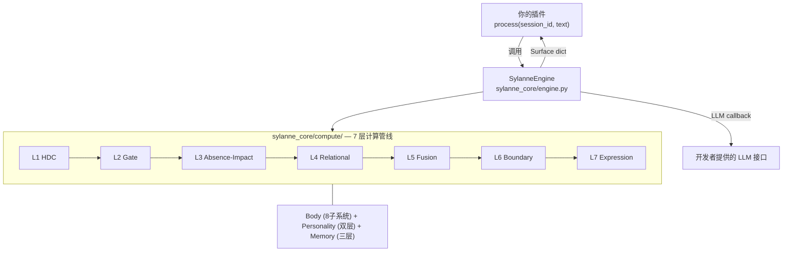

<!-- markdownlint-disable MD033 -->
<!-- markdownlint-disable MD041 -->


<p align="center">
  
  
  
  
</p>

<p align="center">
  <a href="SPEC.md"><strong>📐 标准规范</strong></a> ·
  <a href="AGENT_GUIDE.md"><strong>🤖 开发者指南</strong></a> ·
  <a href="CHANGELOG.md"><strong>📋 更新日志</strong></a>
</p>

---

情感计算引擎 SDK，为其他 AstrBot 插件提供结构化的情感状态计算服务。文本输入，数据输出。不上架插件市场，仅供开发者通过仓库地址安装。

## 快速导航

- [功能特性](#功能特性)
- [输出示例](#输出示例)
- [集成指南](#集成指南)
- [API 说明](#api-说明)
- [配置项详解](#配置项详解)
- [目录结构](#目录结构)
- [架构说明](#架构说明)
- [常见问题](#常见问题)
- [已知限制](#已知限制)
- [许可证](#许可证)
- [标准规范](SPEC.md) — 完整接口协议、输出 Schema、错误处理
- [开发者指南](AGENT_GUIDE.md) — 所有功能模块详解与集成示例

---

## 功能特性

- **7 层计算管线**：HDC 编码 → 预测编码门控 → 缺失-影响引擎 → 关系动力学 → 多专家融合 → 自维持边界 → 表达触发
- **8 子系统情感状态**：rhythm / connection / adaptation / responsiveness / valence / damage / boundary / capacity
- **双层人格系统**：深层 5 维（计算驱动，缓慢漂移）+ 表层 6 维（文本驱动，快速漂移）
- **7 种决策输出**：express / withdraw / recover / reach_out / explore / hold / guard
- **边界守卫**：自主权保护、风险评分、约束列表
- **三层记忆**：L1 热记忆 / L2 温记忆 / L3 冷记忆
- **退化运行**：LLM 不可用时自动退化为本地规则引擎，保证计算不中断
- **调试模式**：断路器状态、各层耗时、健康检查
- **被动接收**：只有插件调用 `process()` 推数据进来才计算，不主动拉取任何数据
- **零外部依赖**：计算引擎本身只依赖 Python 标准库
- **使用案例**：[astrbot_plugin_sylanne](https://github.com/Ayleovelle/astrbot_plugin_sylanne) — 基于 SylannEngine 构建的情感交互插件

---

## 计算原理

### 我们在算什么

一句话：**把聊天记录变成"这个 AI 现在是什么状态、接下来想做什么"。**

传统做法是每条消息独立分类情绪标签，聊完就忘。我们不一样——SylannEngine 维护一个持续演化的内部状态，上一次对话的影响会留到下一次：

```
消息进来 → 更新内部状态 → 产生行动倾向 → 边界检查 → 输出结果
```

三个设计直觉：
- **记得住伤**：被伤害过的系统不会和没被伤害过的系统一样处理相同输入
- **感知得到缺席**：对方三天没说话、主动回避某个话题、话题自然结束——这三种"沉默"含义完全不同
- **有边界感**：不会被外部无限操控，有自主权保护

### 7 层管线怎么跑

| 层 | 干什么 | 类比 |
|---|---|---|
| L1 HDC 编码 | 把文字变成可以快速比较的向量 | 类似 embedding，但是二进制的，更快 |
| L2 预测门控 | 判断这条消息有多"意外"，决定算多少 | 意料之中的消息轻算，意外的消息全栈算 |
| L3 缺失-影响 | 计算伤害的累积和缺席的压力 | 伤口会结疤但不会消失；沉默会产生压力 |
| L4 关系动力学 | 多段关系之间的影响传播 | A 关系里受的伤会影响对 B 的态度 |
| L5 多专家融合 | 把上面所有信号综合成一个决策 | 多个"专家"投票，取 top-2 |
| L6 自维持边界 | 保护人格不被外部轻易改变 | 小冲击自动修复，大冲击才会改变 |
| L7 表达触发 | 决定什么时候该说话 | 压力积累到临界点才爆发，不是线性的 |

### 灵感来源

我们不是在做学术研究，但设计确实参考了一些有意思的理论：

- **超维计算 (HDC)**：用几千维的二进制向量做相似度匹配，比浮点 embedding 快很多
- **自由能原理**：大脑通过预测误差分配注意力资源——我们用来决定一条消息值不值得全栈计算
- **自创生理论**：生命体通过自身运作维持自身组织——我们用来建模人格的自我修复
- **相变理论**：水不是慢慢变成蒸汽的，是到 100°C 突然沸腾——表达行为也是这样

### 性能

纯 Python 实现，无需 GPU：

| 指标 | 实测 |
|------|------|
| 单次计算延迟 (p50) | ~1 ms |
| 单次计算延迟 (p95) | ~1.5 ms |
| 内存占用 | ~123 KB |
| 参数量 | ~10K |

### 想深入了解？

我们写了完整的形式化论文和实验报告，感兴趣可以看：

- [英文论文 (PDF)](docs/scar_void_arxiv_paper_v3.pdf) — 完整公理系统、证明和 11 组实验
- [中文论文 (PDF)](docs/scar_void_arxiv_paper_zh_v4.pdf) — 中文版本

---

## 输出示例

```jsonc
{
    "schema_version": "sylanne.core.v1",
    "session_id": "user_123",
    "turns": 5,
    "state": {
        "rhythm": { "beat": 5.0, "stability": 0.6, "strain": 0.1 },
        "connection": { "warmth": 0.5, "circulation": 0.3, "memory_flow": 0.2 },
        "valence": { "warmth": 0.55, "volatility": 0.1, "recovery_heat": 0.0 },
        "damage": { "open": 0.0, "accumulated": 0.05, "sensitivity": 0.1, "recovery": 0.0 },
        "boundary": { "pressure": 0.1, "autonomy": 0.9, "interruption_budget": 0.8 },
        "needs": { "expression": 0.3, "quiet": 0.1, "recovery": 0.0, "contact": 0.2 }
    },
    "personality": {
        "deep": { "expression_drive": 0.55, "perception_acuity": 0.5, "relational_gravity": 0.6 },
        "surface": { "warmth_bias": 0.6, "curiosity": 0.7, "patience": 0.5 }
    },
    "decision": {
        "action": "express",
        "reason": "expression drive elevated",
        "confidence": 0.75,
        "urgency": 0.3
    },
    "guard": { "allowed": true, "risk_score": 0.1, "constraints": [] },
    "memory": { "recalled": [...], "total_stored": 42 }
}
```

---

## 集成指南

### 安装

将 SylannEngine 作为 git submodule 或直接复制 `sylanne_core/` 到你的插件目录中：

```bash
git submodule add https://github.com/Ayleovelle/SylannEngine.git deps/sylannengine
```

### 初始化引擎

```python
from astrbot.api.star import Context, Star
from sylanne_core import SylanneEngine, SylanneConfig


class MyPlugin(Star):
    def __init__(self, context: Context):
        super().__init__(context)
        self._engine = None

    async def initialize(self):
        self._engine = SylanneEngine(
            data_dir="./data/sylannengine",
            llm=self._llm_call,
            config=SylanneConfig(),
        )
        await self._engine.start()

    async def on_message(self, event):
        if self._engine:
            surface = await self._engine.process(
                session_id="user_123",
                text=event.message_str,
            )
            action = surface["decision"]["action"]
            warmth = surface["state"]["valence"]["warmth"]

    async def _llm_call(self, system_prompt: str, user_prompt: str) -> str:
        """你自己的 LLM 调用实现。"""
        response = await self.context.provider_manager.text_chat(
            prompt=user_prompt, system_prompt=system_prompt,
        )
        return response.completion_text
```

---

## API 说明

| 方法 | 签名 | 说明 |
|------|------|------|
| `process` | `await (session_id, text, **ctx) -> dict` | 处理输入文本，返回完整计算结果 |
| `on` | `(listener) -> None` | 注册推送监听器，process 完成后自动调用 listener(session_id, surface) |
| `off` | `(listener) -> None` | 移除推送监听器 |
| `state` | `(session_id) -> dict` | 查询当前状态（不触发计算） |
| `health` | `() -> dict` | 引擎健康检查 |
| `reset` | `(session_id) -> None` | 重置会话 |

### 上下文参数 (**ctx)

| 参数 | 类型 | 默认值 | 说明 |
|------|------|--------|------|
| `confidence` | `float` | `0.0` | 语义置信度，0 表示由内部评估器计算 |
| `flags` | `list[str]` | `[]` | 事件标签：positive/negative/boundary/recovery/idle/intimate/conflict/farewell/greeting |
| `now` | `float` | `time.time()` | 事件时间戳 |
| `values` | `dict[str, float]` | `{}` | 附加数值信号 |

完整字段定义见 [SPEC.md](SPEC.md)。

---

## 配置项详解

| SylanneConfig 参数 | 默认值 | 说明 |
|------|--------|------|
| `diagnostics` | `False` | 是否返回管线中间态和调试信息 |
| `locale` | `"zh"` | 语言（影响内部评估器 prompt） |
| `memory_capacity` | `1000` | 记忆系统容量上限 |
| `persistence_fsync` | `True` | 持久化写入时是否 fsync |

---

## 目录结构

```
SylannEngine/
├── SPEC.md                          # 标准规范文档（双语）
├── CHANGELOG.md                     # 更新日志
├── LICENSE                          # AGPL-3.0
│
├── docs/                            # 论文与理论文档
│   ├── scar_void_arxiv_paper_v3.pdf # 英文论文
│   └── sylanne_4_alpha_computation_model.tex  # 中文计算模型说明
│
└── sylanne_core/                    # 计算引擎 SDK
    ├── __init__.py                  # 导出 SylanneEngine / SylanneConfig / Surface
    ├── engine.py                    # 引擎入口类
    ├── adapter.py                   # 内部字段 → 标准化字段映射
    ├── assessor.py                  # LLM 语义评估器
    ├── config.py                    # 配置 dataclass
    ├── types.py                     # TypedDict 类型定义
    │
    └── compute/                     # 核心计算模块（零外部依赖）
        ├── computation_spine.py     # 7 层管线调度器
        ├── kernel.py                # 计算核心调度器
        ├── host.py                  # 会话宿主
        ├── runtime.py               # 文件持久化
        ├── body.py                  # 8 子系统状态模型
        ├── personality.py           # 双层人格系统
        ├── memory_system.py         # 三层记忆
        ├── hdc.py                   # L1 超维编码
        ├── predictive_coding.py     # L2 预测编码门控
        ├── void_calculus.py         # L3 缺失演算
        ├── scar_algebra.py          # L3 影响代数
        ├── void_scar_engine.py      # L3 缺失-影响引擎
        ├── relational_sheaf.py      # L4 关系动力学
        ├── hgt.py                   # L5 异构图变换器
        ├── autopoiesis.py           # L6 自维持边界
        ├── phase_transition.py      # L7 表达触发
        └── ...                      # 辅助模块
```

---

## 架构说明



---

## 常见问题

### Q: 怎么在我的插件里用？

```python
from sylanne_core import SylanneEngine, SylanneConfig

engine = SylanneEngine(data_dir="./data/sylannengine", llm=your_llm_call, config=SylanneConfig())
await engine.start()
```

### Q: LLM 挂了会怎样？

引擎自动退化为本地规则引擎评估标签，计算继续运行。`engine.health()` 会显示 `status: "degraded"`。

### Q: 不同用户的状态会互相影响吗？

不会。每个 `session_id` 完全隔离，独立状态、独立持久化。

### Q: 我需要自己提供 LLM 吗？

需要。开发者需要在插件配置页为 SylannEngine 提供可用的 LLM 接口。如果未配置或 LLM 不可用，引擎会自动退化为本地规则引擎，计算不会中断，但语义评估精度会下降。

---

## 已知限制

- **Preview 状态**：API 可能在正式版前发生变更
- **Embedding 可选**：如果 AstrBot 未配置 Embedding 提供商，记忆召回退化为关键词匹配
- **不上架插件市场**：仅通过仓库地址安装

---

## 许可证

GNU Affero General Public License v3.0 - 详见 [LICENSE](LICENSE) 文件。
