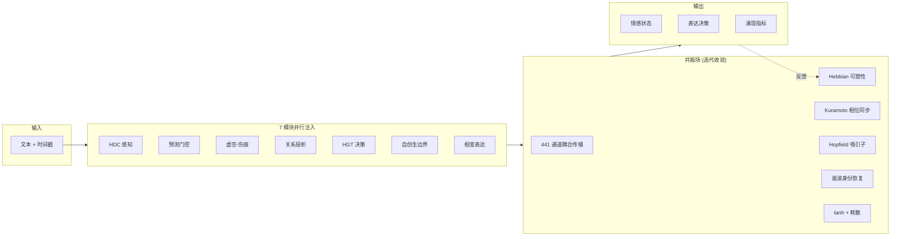
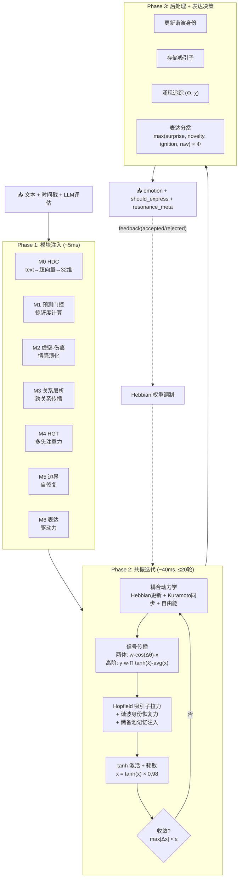
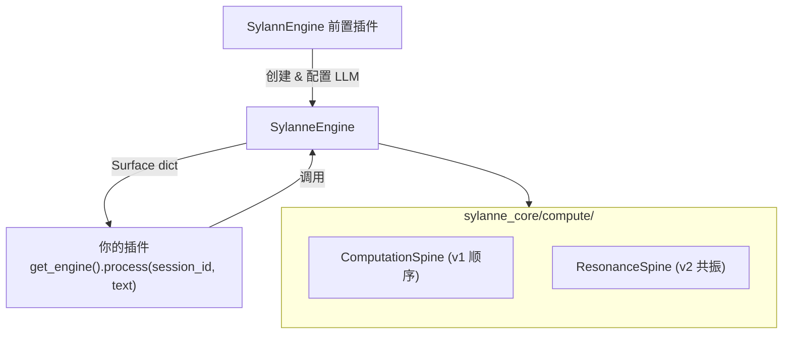

<!-- markdownlint-disable MD033 -->
<!-- markdownlint-disable MD041 -->


<p align="center">
  
  
  
  
</p>

<p align="center">
  <a href="SPEC.md"><strong>📐 标准规范</strong></a> ·
  <a href="AGENT_GUIDE.md"><strong>🤖 开发者指南</strong></a> ·
  <a href="CHANGELOG.md"><strong>📋 更新日志</strong></a>
</p>

---

情感计算引擎 SDK，为其他 AstrBot 插件提供结构化的情感状态计算服务。文本输入，数据输出。

### 安装方式

**插件开发者**（推荐）：在 AstrBot WebUI 的插件页面，选择「从 Git 仓库安装」，输入：

```
https://github.com/Ayleovelle/SylannEngine.git
```

安装后，你的插件里直接 `from sylanne_core import SylanneEngine` 即可。本插件是前置依赖，不处理消息、不监听事件，只确保 SDK 在路径中可用。

**纯 SDK 使用**（不通过 AstrBot 插件系统）：用 [`sdk` 分支](https://github.com/Ayleovelle/SylannEngine/tree/sdk)：

```bash
git submodule add -b sdk https://github.com/Ayleovelle/SylannEngine.git deps/sylannengine
```

## 快速导航

- [功能特性](#功能特性)
- [输出示例](#输出示例)
- [集成指南](#集成指南)
- [API 说明](#api-说明)
- [配置项详解](#配置项详解)
- [目录结构](#目录结构)
- [架构说明](#架构说明)
- [常见问题](#常见问题)
- [已知限制](#已知限制)
- [许可证](#许可证)
- [标准规范](SPEC.md) — 完整接口协议、输出 Schema、错误处理
- [开发者指南](AGENT_GUIDE.md) — 所有功能模块详解与集成示例

---

## 功能特性

- **共振场计算架构（v2）**：7 模块全连接单纯形复形，迭代共振至收敛，表达作为相变涌现
- **441 条有向耦合通道**（max 档）：完整 6-单纯形 Δ⁶，含高阶多体交互
- **用进废退可塑性**：通道使用越多越强，不用的自然萎缩（Hebbian + 神经达尔文主义）
- **谐波身份（灵魂）**：Hodge Laplacian 零空间的拓扑不变量，跨所有扰动持续存在
- **Hopfield 吸引子景观**：情感记忆作为能量极小值，表达 = 逃离吸引子
- **8 子系统情感状态**：rhythm / connection / adaptation / responsiveness / valence / damage / boundary / capacity
- **双层人格系统**：深层 5 维（计算驱动，缓慢漂移）+ 表层 6 维（文本驱动，快速漂移）
- **7 种决策输出**：express / withdraw / recover / reach_out / explore / hold / guard
- **三档性能**：lite (5ms, 42通道) / pro (40ms, 287通道) / max (50ms/CPU, 441通道)
- **退化运行**：LLM 不可用时自动退化为本地规则引擎
- **零外部依赖**（lite 档）：纯 Python 标准库
- **使用案例**：[astrbot_plugin_sylanne](https://github.com/Ayleovelle/astrbot_plugin_sylanne)

---

## 计算原理

### 我们在算什么

一句话：**把聊天记录变成"这个 AI 现在是什么状态、接下来想做什么"。**

不是情绪分类，不是情感标签。是一个**持续演化的动力系统**——上一次对话的影响会留到下一次，伤害会结疤，沉默会产生压力，人格会缓慢漂移。

### v2 共振场架构

v1 是顺序管线（L1→L2→...→L7）。v2 是**全连接共振网络**——7 个模块同时注入信号到共振场，场通过耦合动力学迭代收敛，表达作为相变自发涌现：



### 为什么不用神经网络

| | 神经网络 | 共振场 |
|---|---|---|
| 需要 | 训练数据 + GPU | 无需训练，结构即计算 |
| 输出 | 前向传播算出来 | 迭代收敛涌现出来 |
| 可解释性 | 黑箱 | 每个通道有明确语义 |
| 人格 | 微调？没有标准方式 | 人格 → 拓扑参数，一一对应 |
| 确定性 | 不保证 | 相同输入 → 相同输出 |
| 可移植性 | 需要推理框架 | 纯代数运算，任何语言可实现 |

我们做的是**计算标准**（类似 IEEE 754），不是训练模型。

### 三档性能

| 档位 | 通道数 | 延迟 | 最低配置 | 适用场景 |
|------|--------|------|----------|----------|
| lite | 42（两体） | ~5ms | 任意 CPU, 64MB | 树莓派, 手机, AstrBot 默认 |
| pro | 287（含四体） | ~40ms | 2核, 256MB | 桌面, 云 VM |
| max | 441（完整 Δ⁶） | ~50ms CPU | 4核或 GPU | 研究, 多智能体 |

### 核心机制

| 机制 | 理论来源 | 效果 |
|------|----------|------|
| Hebbian 可塑性 | Hebb 1949, Edelman 1987 | 通道用进废退，系统自动发现重要连接 |
| 高阶 Kuramoto | Millán et al. 2020 | 爆炸性同步 → 表达涌现 |
| 自由能最小化 | Friston 2010 | 预测误差驱动注意力分配 |
| Hopfield 吸引子 | Hopfield 1982 | 情感记忆，表达 = 逃离吸引子 |
| 谐波身份 | Hodge 1941 | 拓扑不变量 = 人格的数学实现 |
| 耗散结构 | Prigogine 1977 | 能量有界，不会死循环 |

### 稳定性保证

即使所有模块同时最大激活，能量稳定在 23.0（理论上限 28.0）。三层保护：
1. **tanh 饱和**：|x| ≤ 1
2. **耗散**：每迭代 ×0.98
3. **残余衰减**：每周期 ×0.7

---

## 输出示例

```jsonc
{
    "schema_version": "sylanne.core.v1",
    "session_id": "user_123",
    "turns": 5,
    "state": {
        "rhythm": { "beat": 5.0, "stability": 0.6, "strain": 0.1 },
        "connection": { "warmth": 0.5, "circulation": 0.3, "memory_flow": 0.2 },
        "valence": { "warmth": 0.55, "volatility": 0.1, "recovery_heat": 0.0 },
        "damage": { "open": 0.0, "accumulated": 0.05, "sensitivity": 0.1, "recovery": 0.0 },
        "boundary": { "pressure": 0.1, "autonomy": 0.9, "interruption_budget": 0.8 },
        "needs": { "expression": 0.3, "quiet": 0.1, "recovery": 0.0, "contact": 0.2 }
    },
    "personality": {
        "deep": { "expression_drive": 0.55, "perception_acuity": 0.5, "relational_gravity": 0.6 },
        "surface": { "warmth_bias": 0.6, "curiosity": 0.7, "patience": 0.5 }
    },
    "decision": {
        "action": "express",
        "reason": "expression drive elevated",
        "confidence": 0.75,
        "urgency": 0.3
    },
    "guard": { "allowed": true, "risk_score": 0.1, "constraints": [] }
}
```

---

## 集成指南

### 安装

通过 AstrBot 插件系统安装本仓库后，你的插件里直接 import 即可：
```

### 使用引擎

LLM 由 SylannEngine 前置插件统一配置（通过 AstrBot 的 LLM 提供商），下游插件无需关心 LLM 接入，直接获取引擎实例调用即可：

```python
from astrbot.api.star import Context, Star
from sylanne_core import get_engine


class MyPlugin(Star):
    def __init__(self, context: Context):
        super().__init__(context)

    async def on_message(self, event):
        engine = get_engine()
        surface = await engine.process(
            session_id="user_123",
            text=event.message_str,
        )
        action = surface["decision"]["action"]
        warmth = surface["state"]["valence"]["warmth"]
```

---

## API 说明

| 方法 | 签名 | 说明 |
|------|------|------|
| `get_engine` | `() -> SylanneEngine` | 获取插件版共享实例（插件版专用） |
| `process` | `await (session_id, text, **ctx) -> Surface` | 处理输入文本，返回完整计算结果 |
| `tick` | `await (session_id, flags?) -> Surface` | 空闲 tick（不含文本输入） |
| `on` | `(listener) -> None` | 注册推送监听器，process 完成后自动调用 listener(session_id, surface) |
| `off` | `(listener) -> None` | 移除推送监听器 |
| `state` | `await (session_id) -> Surface` | 查询当前状态（不触发计算） |
| `health` | `() -> HealthStatus` | 引擎健康检查 |
| `reset` | `await (session_id) -> None` | 重置会话（保留 lock） |
| `destroy` | `await (session_id) -> None` | 彻底销毁会话（含 lock） |
| `exists` | `(session_id) -> bool` | 检查会话是否存在 |

### 上下文参数 (**ctx)

| 参数 | 类型 | 默认值 | 说明 |
|------|------|--------|------|
| `confidence` | `float \| None` | `None` | 语义置信度 [0,1]，None 表示由内部评估器计算 |
| `flags` | `list[str]` | `[]` | 事件标签：positive/negative/boundary/recovery/idle/intimate/conflict/farewell/greeting |
| `now` | `float` | `time.time()` | 事件时间戳 |
| `values` | `dict[str, float]` | `{}` | 附加数值信号 |

完整字段定义见 [SPEC.md](SPEC.md)。

---

## 配置项详解

| SylanneConfig 参数 | 默认值 | 说明 |
|------|--------|------|
| `diagnostics` | `False` | 是否返回管线中间态和调试信息 |
| `assessor_enabled` | `True` | 是否启用 LLM 语义评估器 |
| `locale` | `"zh"` | 语言（影响内部评估器 prompt） |
| `persistence_fsync` | `True` | 持久化写入时是否 fsync |
| `tick_drift_cap` | `0.05` | 单次 tick 人格漂移上限 |

---

## 目录结构

```
SylannEngine/
├── README.md
├── docs/
│   ├── SPEC.md                              # 标准规范
│   ├── resonance_field_spec.md              # 数学规范
│   ├── resonance_field_architecture.md      # 架构规范 (EN)
│   ├── resonance_field_architecture_zh.md   # 架构规范 (中文)
│   └── max_tier_workflow.md                 # MAX 档工作流图
│
└── sylanne_core/
    ├── __init__.py
    ├── engine.py                    # 引擎入口
    ├── config.py                    # 配置 (lite/pro/max)
    ├── types.py                     # TypedDict 类型
    │
    └── compute/
        ├── computation_spine.py     # v1 顺序管线
        ├── resonance_field.py       # v2 共振场核心
        ├── coupling_dynamics.py     # Hebbian + Kuramoto + 自由能
        ├── emergence.py             # Φ + 序参量 + 吸引子 + 时间叙事
        ├── resonance_integration.py # v2 drop-in 替代 (ResonanceSpine)
        ├── hdc.py                   # M0 超维编码
        ├── predictive_coding.py     # M1 预测门控
        ├── void_scar_engine.py      # M2 虚空-伤痕
        ├── relational_sheaf.py      # M3 关系层析
        ├── hgt.py                   # M4 异构图变换器
        ├── autopoiesis.py           # M5 自创生边界
        ├── phase_transition.py      # M6 相变表达
        └── ...
```

---

## 架构说明

### 共振场计算流程（MAX 档）



### 插件版架构



### 详细文档

| 文档 | 内容 | 语言 |
|------|------|------|
| [SPEC.md](docs/SPEC.md) | 标准规范（公理、数据模型、合规测试） | EN |
| [resonance_field_architecture.md](docs/resonance_field_architecture.md) | 架构详细规范 + 开发者指南 | EN |
| [resonance_field_architecture_zh.md](docs/resonance_field_architecture_zh.md) | 架构详细规范 + 开发者指南 | 中文 |
| [resonance_field_spec.md](docs/resonance_field_spec.md) | 形式化数学规范 | EN |
| [max_tier_workflow.md](docs/max_tier_workflow.md) | MAX 档完整 Mermaid 工作流 | EN |

---

## 常见问题

### Q: 怎么在我的插件里用？

```python
from sylanne_core import get_engine

engine = get_engine()  # 获取前置插件已配置好的共享实例
surface = await engine.process(session_id="user_123", text="你好")
```

### Q: LLM 挂了会怎样？

引擎自动退化为本地规则引擎评估标签，计算继续运行。`engine.health()` 会显示 `status: "degraded"`。

### Q: 不同用户的状态会互相影响吗？

不会。每个 `session_id` 完全隔离，独立状态、独立持久化。

### Q: 我需要自己提供 LLM 吗？

**插件版**：不需要。LLM 由 SylannEngine 前置插件通过 AstrBot 的 LLM 提供商统一配置，下游插件直接调用 `get_engine()` 即可。

**SDK 版**：需要。你需要自己实现 `async (system_prompt, user_prompt) -> str` 回调并传给 `SylanneEngine(llm=...)`。

---

## 已知限制

- **RC 状态**：API 已稳定，1.0 正式版前仅修复 bug，不做 breaking change

---

## 许可证

GNU Affero General Public License v3.0 - 详见 [LICENSE](LICENSE) 文件。

**本计算引擎开源免费，不希望被用于商业用途。** 如果你从中获益，希望你也能回馈社区。使用时如果愿意，请注明原作者 [Ayleovelle](https://github.com/Ayleovelle)。

---

## Star History

[](https://star-history.com/#Ayleovelle/SylannEngine&Date)
