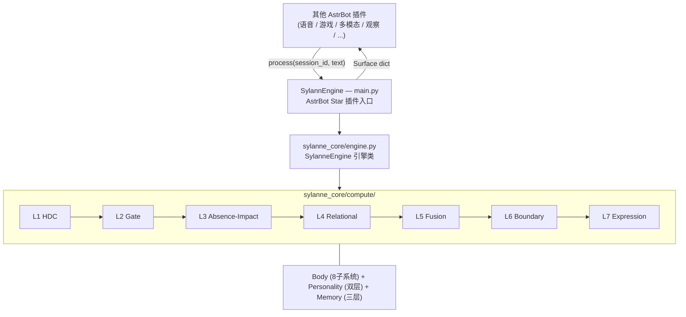

<!-- markdownlint-disable MD033 -->
<!-- markdownlint-disable MD041 -->


<p align="center">
  
  
  
  
</p>

---

情感计算引擎 SDK，为其他 AstrBot 插件提供结构化的情感状态计算服务。文本输入，数据输出。不上架插件市场，仅供开发者通过仓库地址安装。

## 快速导航

- [功能特性](#功能特性)
- [输出示例](#输出示例)
- [集成指南](#集成指南)
- [API 说明](#api-说明)
- [配置项详解](#配置项详解)
- [目录结构](#目录结构)
- [架构说明](#架构说明)
- [常见问题](#常见问题)
- [已知限制](#已知限制)
- [许可证](#许可证)

---

## 功能特性

- **7 层计算管线**：HDC 编码 → 预测编码门控 → 缺失-影响引擎 → 关系动力学 → 多专家融合 → 自维持边界 → 表达触发
- **8 子系统情感状态**：rhythm / connection / adaptation / responsiveness / valence / damage / boundary / capacity
- **双层人格系统**：深层 5 维（计算驱动，缓慢漂移）+ 表层 6 维（文本驱动，快速漂移）
- **7 种决策输出**：express / withdraw / recover / reach_out / explore / hold / guard
- **边界守卫**：自主权保护、风险评分、约束列表
- **三层记忆**：L1 热记忆 / L2 温记忆 / L3 冷记忆
- **退化运行**：LLM 不可用时自动退化为本地规则引擎，永不崩溃
- **调试模式**：断路器状态、各层耗时、健康检查
- **被动接收**：只有插件调用 `process()` 推数据进来才计算，不主动拉取任何数据
- **零外部依赖**：计算引擎本身只依赖 Python 标准库

---

## 输出示例

```jsonc
{
    "schema_version": "sylanne.core.v1",
    "session_id": "user_123",
    "turns": 5,
    "state": {
        "rhythm": { "beat": 5.0, "stability": 0.6, "strain": 0.1 },
        "connection": { "warmth": 0.5, "circulation": 0.3, "memory_flow": 0.2 },
        "valence": { "warmth": 0.55, "volatility": 0.1, "recovery_heat": 0.0 },
        "damage": { "open": 0.0, "accumulated": 0.05, "sensitivity": 0.1, "recovery": 0.0 },
        "boundary": { "pressure": 0.1, "autonomy": 0.9, "interruption_budget": 0.8 },
        "needs": { "expression": 0.3, "quiet": 0.1, "recovery": 0.0, "contact": 0.2 }
    },
    "personality": {
        "deep": { "expression_drive": 0.55, "perception_acuity": 0.5, "relational_gravity": 0.6 },
        "surface": { "warmth_bias": 0.6, "curiosity": 0.7, "patience": 0.5 }
    },
    "decision": {
        "action": "express",
        "reason": "expression drive elevated",
        "confidence": 0.75,
        "urgency": 0.3
    },
    "guard": { "allowed": true, "risk_score": 0.1, "constraints": [] },
    "memory": { "recalled": [...], "total_stored": 42 }
}
```

---

## 集成指南

### 声明依赖

在你的插件 `metadata.yaml` 中添加：

```yaml
dependencies:
  - astrbot_plugin_sylannengine
```

AstrBot 会在加载你的插件前确保 SylannEngine 已就绪。

### 获取引擎实例

```python
from astrbot.api.star import Context, Star


class MyPlugin(Star):
    def __init__(self, context: Context):
        super().__init__(context)
        self._engine = None

    async def initialize(self):
        engine_star = self.context.get_registered_star("astrbot_plugin_sylannengine")
        if engine_star:
            self._engine = engine_star.star_instance

    async def on_message(self, event):
        if self._engine:
            surface = await self._engine.process(
                session_id="user_123",
                text=event.message_str,
            )
            action = surface["decision"]["action"]
            warmth = surface["state"]["valence"]["warmth"]
```

---

## API 说明

| 方法 | 签名 | 说明 |
|------|------|------|
| `process` | `await (session_id, text, **ctx) -> dict` | 处理输入文本，返回完整计算结果 |
| `tick` | `await (session_id, flags) -> dict` | 无文本的状态推进（时间衰减等） |
| `state` | `(session_id) -> dict` | 查询当前状态（不触发计算） |
| `health` | `() -> dict` | 引擎健康检查 |
| `reset` | `(session_id) -> None` | 重置会话 |

### 上下文参数 (**ctx)

| 参数 | 类型 | 默认值 | 说明 |
|------|------|--------|------|
| `confidence` | `float` | `0.0` | 语义置信度，0 表示由内部评估器计算 |
| `flags` | `list[str]` | `[]` | 事件标签：positive/negative/boundary/recovery/idle/intimate/conflict/farewell/greeting |
| `now` | `float` | `time.time()` | 事件时间戳 |
| `values` | `dict[str, float]` | `{}` | 附加数值信号 |

完整字段定义见 [SPEC.md](SPEC.md)。

---

## 配置项详解

| 配置 | 默认值 | 说明 |
|------|--------|------|
| `sylannengine_data_dir` | `./data/sylannengine` | 持久化目录 |
| `sylannengine_diagnostics` | `false` | 是否返回管线中间态和调试信息 |
| `sylannengine_locale` | `zh` | 语言（影响内部评估器 prompt） |

---

## 目录结构

```
SylannEngine/
├── main.py                          # AstrBot 插件入口
├── metadata.yaml                    # 插件元数据
├── SPEC.md                          # 标准规范文档（双语）
├── CHANGELOG.md                     # 更新日志
├── LICENSE                          # AGPL-3.0
│
└── sylanne_core/                    # 计算引擎 SDK
    ├── __init__.py                  # 导出 SylanneEngine / SylanneConfig / Surface
    ├── engine.py                    # 引擎入口类
    ├── adapter.py                   # 内部字段 → 标准化字段映射
    ├── assessor.py                  # LLM 语义评估器
    ├── config.py                    # 配置 dataclass
    ├── types.py                     # TypedDict 类型定义
    │
    └── compute/                     # 核心计算模块（零外部依赖）
        ├── computation_spine.py     # 7 层管线调度器
        ├── kernel.py                # 计算核心调度器
        ├── host.py                  # 会话宿主
        ├── runtime.py               # 文件持久化
        ├── body.py                  # 8 子系统状态模型
        ├── personality.py           # 双层人格系统
        ├── memory_system.py         # 三层记忆
        ├── hdc.py                   # L1 超维编码
        ├── predictive_coding.py     # L2 预测编码门控
        ├── void_calculus.py         # L3 缺失演算
        ├── scar_algebra.py          # L3 影响代数
        ├── void_scar_engine.py      # L3 缺失-影响引擎
        ├── relational_sheaf.py      # L4 关系动力学
        ├── hgt.py                   # L5 异构图变换器
        ├── autopoiesis.py           # L6 自维持边界
        ├── phase_transition.py      # L7 表达触发
        └── ...                      # 辅助模块
```

---

## 架构说明



---

## 常见问题

### Q: 其他插件怎么获取引擎实例？

```python
engine_star = self.context.get_registered_star("astrbot_plugin_sylannengine")
engine = engine_star.star_instance
```

### Q: LLM 挂了会怎样？

引擎自动退化为本地规则引擎评估标签，计算继续运行。`engine.health()` 会显示 `status: "degraded"`。

### Q: 不同用户的状态会互相影响吗？

不会。每个 `session_id` 完全隔离，独立状态、独立持久化。

### Q: 我需要自己提供 LLM 吗？

不需要。SylannEngine 自动使用 AstrBot 已配置的 LLM 提供商。

---

## 已知限制

- **Preview 状态**：API 可能在正式版前发生变更
- **Embedding 可选**：如果 AstrBot 未配置 Embedding 提供商，记忆召回退化为关键词匹配
- **不上架插件市场**：仅通过仓库地址安装

---

## 许可证

GNU Affero General Public License v3.0 - 详见 [LICENSE](LICENSE) 文件。
