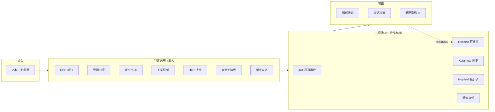

<!-- markdownlint-disable MD033 -->
<!-- markdownlint-disable MD041 -->


<p align="center">
  
  
  
</p>

<p align="center">
  <a href="SPEC.md"><strong>📐 标准规范</strong></a> ·
  <a href="AGENT_GUIDE.md"><strong>🤖 开发者指南</strong></a> ·
  <a href="CHANGELOG.md"><strong>📋 更新日志</strong></a> ·
  <a href="docs/resonance_field_paper_en.pdf"><strong>📄 论文 (EN)</strong></a> ·
  <a href="docs/resonance_field_paper_zh.pdf"><strong>📄 论文 (中文)</strong></a>
</p>

---

## 这是什么

情感计算引擎 SDK。文本输入，结构化情感状态输出。回答"AI 现在是什么情绪、接下来想做什么"。

不是情绪分类，不是情感标签。是一个**持续演化的动力系统**——上一次对话的影响会留到下一次，伤害会结疤，沉默会产生压力，人格会缓慢漂移。

---

## 安装

把 `sylanne_core/` 目录复制进你的项目，或作为 git submodule 引入：

```bash
git submodule add https://github.com/Ayleovelle/SylannEngine.git deps/sylannengine
```

```python
import sys
sys.path.insert(0, "./deps/sylannengine")
```

---

## 30 秒上手

```python
from sylanne_core import SylanneEngine, SylanneConfig

engine = SylanneEngine(
    data_dir="./data/sylannengine",
    llm=your_llm_callback,   # 自己实现 async (system_prompt, user_prompt) -> str
    config=SylanneConfig(),
)
await engine.start()

surface = await engine.process(session_id="user_123", text="你好")

action = surface["decision"]["action"]   # "express" / "withdraw" / "hold" / ...
warmth = surface["state"]["valence"]["warmth"]  # 0.0 ~ 1.0
should_speak = surface["decision"]["action"] == "express"
```

---

## V2 共振场架构

V1 是顺序管线（L1→L2→...→L7），表达率仅 22.8%——bot 大部分时间沉默。

V2 是**全连接共振网络**——7 个模块同时注入信号到共振场，场通过耦合动力学迭代收敛，表达作为相变自发涌现。表达率 88.5%，动态范围 3.3×。



### V1 vs V2 实测对比（lite 档，500 ticks × 10 repeats）

| 指标 | V1 顺序管线 | V2 共振场 | 提升 |
|------|------------|-----------|------|
| 表达率 | 22.8% ± 9.8% | **88.5% ± 6.0%** | 3.9× |
| 动态范围 | 16.5 ± 1.1 | **54.5 ± 1.3** | 3.3× |
| 动态丰富度 | 7.8 ± 1.0 | **19.3 ± 1.1** | 2.5× |
| 响应多样性 | 10/10 | 10/10 | — |

升级后 bot 从"大部分时间沉默"变成"积极表达"，无需改任何配置。

---

## 三档性能

| 档位 | 通道数 | 延迟 | 依赖 | 适用场景 |
|------|--------|------|------|----------|
| **lite** | 42（两体） | ~5ms | 零依赖 | 嵌入式，树莓派，手机 |
| **pro** | 287（含四体） | ~40ms | numpy | 桌面，云 VM |
| **max** | 441（完整 Δ⁶） | ~50ms | numpy | 研究，多智能体 |

档位可自由切换：`engine.switch_tier("pro")`。

---

## 核心机制

| 机制 | 理论来源 | 效果 |
|------|----------|------|
| Hebbian 可塑性 | Hebb 1949 | 通道用进废退，系统自动发现重要连接 |
| 高阶 Kuramoto | Millán 2020 | 爆炸性同步 → 表达涌现 |
| 自由能最小化 | Friston 2010 | 预测误差驱动注意力分配 |
| Hopfield 吸引子 | Hopfield 1982 | 情感记忆，表达 = 逃离吸引子 |
| 谐波身份 | Hodge 1941 | 拓扑不变量 = 人格的数学实现 |
| 耗散结构 | Prigogine 1977 | 能量有界，不会死循环 |

---

## 输出示例

```jsonc
{
    "session_id": "user_123",
    "state": {
        "rhythm": { "beat": 5.0, "stability": 0.6 },
        "valence": { "warmth": 0.55, "volatility": 0.1 },
        "boundary": { "pressure": 0.1, "autonomy": 0.9 },
        "needs": { "expression": 0.3, "contact": 0.2 }
    },
    "decision": {
        "action": "express",
        "reason": "expression drive elevated",
        "confidence": 0.75
    },
    "guard": { "allowed": true, "risk_score": 0.1 }
}
```

---

## API

| 方法 | 说明 |
|------|------|
| `await process(session_id, text, **ctx)` | 处理文本，返回 Surface |
| `await tick(session_id)` | 空闲心跳 |
| `feedback(session_id, "accepted"/"rejected")` | 反馈调制可塑性 |
| `inject(session_id, source, type, intensity)` | 外部影响注入 |
| `on(listener)` / `off(listener)` | 推送监听 |
| `health()` | 健康检查 |
| `exists(session_id)` | 会话是否存在 |

完整接口见 [SPEC.md](SPEC.md)。

---

## 为什么不用神经网络

| | 神经网络 | 共振场 |
|---|---|---|
| 需要 | 训练数据 + GPU | 无需训练，结构即计算 |
| 输出 | 前向传播算出来 | 迭代收敛涌现出来 |
| 可解释性 | 黑箱 | 每个通道有明确语义 |
| 人格控制 | 微调？没有标准方式 | 人格 → 拓扑参数，一一对应 |
| 确定性 | 不保证 | 相同输入 → 相同输出 |
| 可移植性 | 需要推理框架 | 纯代数运算，任何语言可实现 |

我们做的是**计算标准**（类似 IEEE 754），不是训练模型。

---

## 目录结构

```
SylannEngine/
├── sylanne_core/
│   ├── __init__.py              # 公共 API
│   ├── engine.py                # SylanneEngine 入口
│   ├── config.py                # 三档配置
│   └── compute/
│       ├── resonance_field.py       # 共振场核心
│       ├── resonance_integration.py # ResonanceSpine (V2 默认)
│       ├── coupling_dynamics.py     # Hebbian + Kuramoto + 自由能
│       ├── emergence.py             # Φ + 吸引子 + 时间叙事
│       ├── kernel.py                # 调度器
│       ├── hot_pool.py              # 热池与人格坍缩
│       ├── personality.py           # 双 EMA 人格漂移
│       └── ...                      # HDC, HGT, 自创生, 相变等
├── experiments/                 # 12 项实验验证
├── tests/                       # 434 单元测试
└── docs/                        # 论文 + 规范
```

---

## 文档

| 文档 | 内容 |
|------|------|
| [SPEC.md](SPEC.md) | 标准规范（接口协议、输出 Schema） |
| [AGENT_GUIDE.md](AGENT_GUIDE.md) | 开发者集成指南 |
| [论文 (EN)](docs/resonance_field_paper_en.pdf) | 21 页，12 实验，完整数学推导 |
| [论文 (中文)](docs/resonance_field_paper_zh.pdf) | 16 页中文版 |
| [架构规范](docs/resonance_field_architecture.md) | 完整架构 + 42 耦合方程 |

---

## 常见问题

**Q: LLM 挂了会怎样？**
引擎自动退化为本地规则引擎，计算继续。`health()` 显示 `"degraded"`。

**Q: 不同用户状态会互相影响吗？**
不会。每个 session_id 完全隔离。

**Q: 怎么接入？**
```python
from sylanne_core import SylanneEngine, SylanneConfig

engine = SylanneEngine(data_dir="./data", llm=your_llm_fn, config=SylanneConfig())
await engine.start()
surface = await engine.process("user_123", "你好")
```

`llm` 是你自己实现的 async `(system_prompt, user_prompt) -> str` 回调，引擎不绑定任何特定 LLM 提供商。

---

## 许可证

GNU Affero General Public License v3.0

**本计算引擎开源免费，不希望被用于商业用途。** 如果你从中获益，希望你也能回馈社区。

---

## 演化路线

### V2.0 — 共振场（当前稳定版）

基于物理启发的规则系统。7 模块 × 441 通道耦合，Hebbian 可塑性 + Kuramoto 同步。无需训练，结构即计算。适用于实时情感推理。

### V2.1 — EmotiCore（迭代中）

Teacher 模型 102.7M 参数（Mamba SSM + MoE + Multi-scale ConvStem + VAE + 对比学习）。初版 teacher 已在中文标注语料上训练完成；目前正在扩充标注数据后重新训练，以提升泛化和情感维度精度。最终部署版本将通过蒸馏压缩为轻量 Student 模型。

用途：处理日常情感感知以降低 assessor LLM 的 token 消耗和延迟，LLM 仍保留用于后学习与复杂场景。同时作为 V3 的感知基准和数据源。

**后学习机制：**
- **链路学习**（共振场层）：Hebbian 可塑性持续调整通道耦合权重，高频共激活的情感路径被强化，低频路径衰减——系统适应用户的情感模式
- **模型校准**（EmotiCore 层）：高不确定度或复杂场景时回退 LLM assessor，LLM 返回的标注作为在线信号校准 EmotiCore 参数
- 随使用时间增长，链路越来越贴合用户，EmotiCore 越来越准，LLM 调用频率逐步降低

### V3.0 — SYLANN（实验阶段）🔬

**"Scars You Leave Are Never Nothing"**
*A Self-Organizing Developmental Architecture for Adaptive Intelligence*

探索一种不依赖 backpropagation 的情感计算架构。基于 Temporal Predictive Coding + WTA 竞争：

```
多个 cell 竞争预测下一个字符，赢家学习，输家等待。
预测误差驱动权重更新。完全局部，无全局梯度链。
```

**架构：**
- Temporal Predictive Coding：4 层分级 state 累积上下文，每层衰减更慢（0.85 → 0.925 → 0.963 → 0.981），对应字符 → 词 → 语义 → 抽象的时间尺度
- 非线性预测器：`W2 @ tanh(W1 @ concat_state)`，从拼接的多层状态预测下一个输入
- WTA 竞争：64 个 cell 各自预测，top-k 赢家获得学习权
- 多序列并行：256 条序列同时处理，共享权重，GPU 利用率 >90%
- 不可逆发育：负面经历留下 scar（永久降低可塑性）
- reward 调制：emotion label 作为环境信号，调制学习强度

**训练方式：**

逐字符处理文本。80% 无标注数据学语言结构（纯预测），20% 标注数据通过 reward 信号学情感关联。语言和情感在同一个过程中同时形成。

**当前状态：**
- 多序列并行训练已跑通 27.8M ticks，val_err 从随机基线 0.0886 降到 0.082（真实预测能力，固定留出句子上测量）
- **关键发现：情感维度在还没开始打标时就涌现了**——系统纯粹通过预测下一个字符学习，不接触任何情感标签，但深层 state 已经能区分悲伤/快乐文本（cosine ≈ 0.07），8 个情感维度中有 4 个出现了相关信号（valence、warmth、vulnerability、hostility）
- 15.6GB 中英文语料已备齐
- 这暗示：情感不是要额外"教"给系统的标签，而是语言预测任务本身就隐含的结构

**局限性：**

V3 是一个诚实但不彻底的尝试。它的几个根本局限：

- **本质仍是猜词游戏**：预测下一个字符，这和 transformer 的训练目标是同一个，只是把 backprop 换成了局部规则。它没有跳出"预测"这个框架。
- **依赖"正确答案"**：学习信号来自预测误差（你猜的和真实下一个字符的差）。系统需要一个外部目标才能学，不是真正的自主。
- **被动反应**：state 只在有输入时才更新，没输入就静止。它不会"自己想事情"，没有内在活动。
- **情感是读出来的，不是活的**：情感维度从深层 state 被动读取，reward 只是调制学习率。情感不参与驱动系统本身的演化。
- **规模与速度**：64 cells、逐字符处理，离能支撑复杂能力的规模还很远。

**未来方向：**

V3 的这些局限大多源于同一个根：它仍然是个预测器。不久的将来可能会尝试一条更激进的路——让系统不再依赖"预测下一个字符"这个目标，而是作为一个持续运转的自组织过程，让感知、语言、情感从中一起长出来。这条路更长、更不确定，能不能走通还不知道，但值得一试。

核心假设：Predictive Coding + WTA + reward modulation + 足够数据 = 无需 backprop 的情感感知系统。情感的自发涌现是这个假设最有力的早期证据——它说明感知能力可以从纯预测中长出来，而不必依赖标注监督。

技术规范：[`training/SYLANN_V3_SPEC.md`](training/SYLANN_V3_SPEC.md)

---

## Star History

[](https://star-history.com/#Ayleovelle/SylannEngine&Date)
