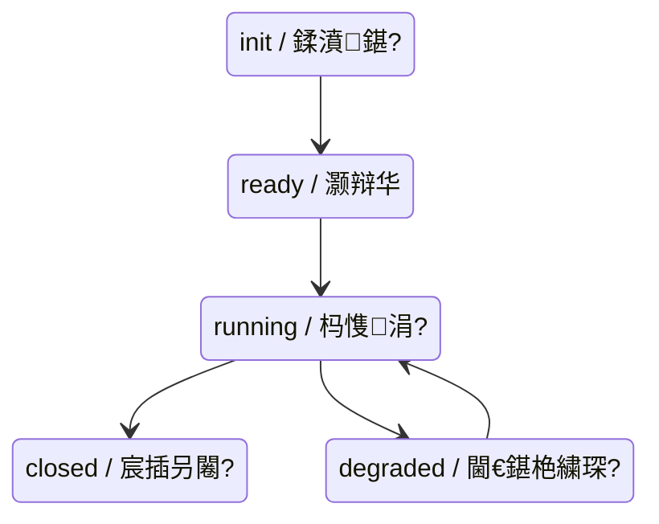

# Sylanne-Core SDK 鏍囧噯瑙勮寖

鐗堟湰锛歚2.0.0`
鍗忚鐗堟湰锛歚sylanne.core.v1`

---

## 1. Overview / 姒傝堪

Sylanne-Core is an affective computation engine SDK for AstrBot plugin developers.
Sylanne-Core 鏄潰鍚?AstrBot 鎻掍欢寮€鍙戣€呯殑鎯呮劅璁＄畻寮曟搸 SDK銆?

**Positioning / 瀹氫綅**: Pure computation black-box. Text in, structured data out. No reply generation, no prompt injection, no message routing.
绾绠楅粦鐩掋€傛枃鏈緭鍏ワ紝缁撴瀯鍖栨暟鎹緭鍑恒€備笉鐢熸垚鍥炲锛屼笉娉ㄥ叆 prompt锛屼笉绠℃秷鎭敹鍙戙€?

---

## 2. Interface Protocol / 鎺ュ彛鍗忚

### 2.0 Installation / 瀹夎鏂瑰紡

Two distribution channels are available: / 鎻愪緵涓ょ鍒嗗彂鏂瑰紡锛?

#### Plugin Version (recommended) / 鎻掍欢鐗堬紙鎺ㄨ崘锛?

Install via AstrBot plugin system. Other plugins can then `from sylanne_core import SylanneEngine` directly.
閫氳繃 AstrBot 鎻掍欢绯荤粺瀹夎鍓嶇疆鎻掍欢锛屽叾浠栨彃浠剁洿鎺?import 浣跨敤銆?

```
瀹夎鍦板潃锛歨ttps://github.com/Ayleovelle/SylannEngine.git
```

```python
# 浣犵殑鎻掍欢浠ｇ爜涓?
from sylanne_core import SylanneEngine, SylanneConfig

engine = SylanneEngine(
    data_dir="./data/sylannengine",
    llm=your_llm_call,         # 閫氳繃 AstrBot provider_manager 璋冪敤
    config=SylanneConfig(),
)
await engine.start()
```

#### SDK Version / SDK 鐗?

Use the `sdk` branch as a git submodule or copy `sylanne_core/` into your project.
浣跨敤 `sdk` 鍒嗘敮浣滀负 submodule 鎴栫洿鎺ュ鍒?`sylanne_core/` 鐩綍銆?

```bash
git submodule add -b sdk https://github.com/Ayleovelle/SylannEngine.git deps/sylannengine
```

```python
import sys
sys.path.insert(0, "./deps/sylannengine")

from sylanne_core import SylanneEngine, SylanneConfig

engine = SylanneEngine(
    data_dir="./data/sylannengine",
    llm=your_own_llm_callback,  # 鑷瀹炵幇 async (str, str) -> str
    config=SylanneConfig(),
)
await engine.start()
```

The SDK version does not depend on AstrBot. / SDK 鐗堜笉渚濊禆 AstrBot銆?

### 2.1 Engine Initialization / 寮曟搸鍒濆鍖?

```python
from sylanne_core import SylanneEngine

engine = SylanneEngine(
    data_dir: str | Path,                          # 鎸佷箙鍖栫洰褰曪紙蹇呭～锛?
    llm: Callable[[str, str], Awaitable[str]],     # LLM 鍥炶皟鍑芥暟锛堝繀濉級
    embedding: Callable[[str], Awaitable[list[float]]] | None = None,  # 鍚戦噺鍖栧洖璋冿紙鍙€夛級
    config: SylanneConfig | None = None,           # 閰嶇疆瑕嗙洊锛堝彲閫夛級
)
```

### 2.2 Core Methods / 鏍稿績鏂规硶

| Method / 鏂规硶 | Signature / 绛惧悕 | Description / 璇存槑 |
|--------|-----------|-------------|
| `process` | `async (session_id: str, text: str, **ctx) -> Surface` | 澶勭悊杈撳叆鏂囨湰锛岃繑鍥炲畬鏁磋绠楃粨鏋?|
| `tick` | `async (session_id: str, flags: list[str]) -> Surface` | 鏃犳枃鏈殑鐘舵€佹帹杩涳紙鏃堕棿琛板噺銆佸喎鍗寸瓑锛?|
| `state` | `async (session_id: str) -> Surface` | 鏌ヨ褰撳墠鐘舵€侊紙涓嶈Е鍙戣绠楋級 |
| `reset` | `async (session_id: str) -> None` | 閲嶇疆浼氳瘽鐘舵€?|
| `destroy` | `async (session_id: str) -> None` | 閿€姣佷細璇濆強鎸佷箙鍖栨暟鎹?|
| `exists` | `(session_id: str) -> bool` | 妫€鏌ヤ細璇濇槸鍚﹀瓨鍦?|

### 2.3 Context Parameters / 涓婁笅鏂囧弬鏁?(`**ctx`)

| Parameter / 鍙傛暟 | Type / 绫诲瀷 | Default / 榛樿鍊?| Description / 璇存槑 |
|-----------|------|---------|-------------|
| `confidence` | `float \| None` | `None` | 璇箟缃俊搴?[0, 1]锛孨one 琛ㄧず鐢卞唴閮?assessor 璁＄畻 |
| `flags` | `list[str]` | `[]` | 浜嬩欢鏍囩锛堣 3.3 鑺傦級 |
| `now` | `float` | `time.time()` | 浜嬩欢鏃堕棿鎴筹紙Unix epoch锛?|
| `values` | `dict[str, float]` | `{}` | 闄勫姞鏁板€间俊鍙?|

---

## 3. Event & Callback Protocol / 浜嬩欢涓庡洖璋冨崗璁?

### 3.1 LLM Callback Signature / LLM 鍥炶皟绛惧悕

```python
async def llm_callback(system_prompt: str, user_prompt: str) -> str:
    """
    Args:
        system_prompt: 绯荤粺鎸囦护锛堝 "璇勪及浠ヤ笅鏂囨湰鐨勬儏鎰熷€惧悜"锛?
        user_prompt: 寰呰瘎浼扮殑鏂囨湰
    Returns:
        LLM 鏂囨湰鍝嶅簲
    Raises:
        浠讳綍寮傚父浼氳寮曟搸鎹曡幏锛岃娆¤皟鐢ㄩ€€鍖栦负鏈湴璁＄畻
    """
```

Internal LLM call scenarios / 寮曟搸鍐呴儴璋冪敤 LLM 鐨勫満鏅細
- **Assessor / 璇箟璇勪及鍣?*锛氬垎绫绘爣绛撅紙positive/negative/boundary/recovery锛?

### 3.2 Embedding Callback Signature / Embedding 鍥炶皟绛惧悕

```python
async def embedding_callback(text: str) -> list[float]:
    """
    Args:
        text: 寰呭悜閲忓寲鐨勬枃鏈?
    Returns:
        娴偣鍚戦噺锛堢淮搴︿笉闄愶紝寮曟搸鍐呴儴浣跨敤浣欏鸡鐩镐技搴︼級
    Raises:
        澶辫触鏃堕€€鍖栦负鍏抽敭璇嶅尮閰嶅彫鍥?
    """
```

### 3.3 Event Tag Enum / 浜嬩欢鏍囩鏋氫妇 (flags)

鍒嗕负 **semantic tags / 璇箟鏍囩**锛堟弿杩版枃鏈€ц川锛夊拰 **phase tags / 闃舵鏍囩**锛堟弿杩拌皟鐢ㄦ椂鏈猴級銆?

#### Semantic Tags / 璇箟鏍囩

| Tag / 鏍囩 | Meaning / 鍚箟 |
|-----|---------|
| `positive` | 姝ｅ悜/瀹夊叏浜や簰 |
| `negative` | 璐熷悜/浼ゅ鎬у唴瀹?|
| `boundary` | 杈圭晫瑙︾ |
| `recovery` | 淇/鎭㈠琛屼负 |
| `idle` | 绌洪棽/鏃犲疄璐ㄥ唴瀹?|
| `intimate` | 浜插瘑鍐呭 |
| `conflict` | 鍐茬獊鍐呭 |
| `farewell` | 鍛婂埆 |
| `greeting` | 闂€?|

#### Phase Tags / 闃舵鏍囩

| Tag / 鏍囩 | Meaning / 鍚箟 |
|-----|---------|
| `request` | 鐢ㄦ埛鍙戞潵娑堟伅 |
| `response` | AI 鍥炲瀹屾垚 |
| `proactive` | 涓诲姩妫€鏌?|

Unrecognized tags are silently ignored. / 鏈瘑鍒殑鏍囩浼氳闈欓粯蹇界暐銆?

---

## 4. Output Schema (Surface) / 杈撳嚭鏁版嵁鏍煎紡

### 4.1 Top-Level Structure / 椤跺眰缁撴瀯

```jsonc
{
    "schema_version": "sylanne.core.v1",   // 鍗忚鐗堟湰
    "session_id": "string",                // 浼氳瘽鏍囪瘑
    "turns": 0,                            // 绱浜や簰杞
    "timestamp": 1716960000.0,             // 璁＄畻鏃堕棿鎴?

    "state": { ... },          // 鎯呮劅鐘舵€侊紙8 瀛愮郴缁燂級
    "personality": { ... },    // 浜烘牸鐘舵€侊紙鍙屽眰锛?
    "decision": { ... },       // 鍐崇瓥杈撳嚭
    "guard": { ... },          // 杈圭晫瀹堝崼
    "pipeline": { ... },       // 7 灞傜绾夸腑闂存€侊紙diagnostics=True 鏃惰繑鍥烇級
    "dynamics": { ... },       // 鍔ㄥ姏瀛︽寚鏍?
    "debug": { ... }           // 璋冭瘯淇℃伅锛坉iagnostics=True 鏃惰繑鍥烇紝瑙?4.9锛?
}
```

### 4.2 state 鈥?Affective State / 鎯呮劅鐘舵€侊紙8 瀛愮郴缁燂級

All values in `[0.0, 1.0]` unless noted otherwise. / 鎵€鏈夋暟鍊艰寖鍥?[0.0, 1.0]锛岄櫎闈炵壒鍒爣娉ㄣ€?

```jsonc
{
    "rhythm": {                            // 浜や簰鑺傚緥
        "beat": 0.0,                       // 绱浜や簰璁℃暟锛堝崟璋冮€掑锛屾棤涓婇檺锛?
        "stability": 0.5,                  // 鑺傚緥绋冲畾鎬?
        "strain": 0.0                      // 搴旀縺璐熻嵎
    },
    "connection": {                        // 杩炴帴鐘舵€?
        "warmth": 0.4,                     // 鍏崇郴娓╂殩搴?
        "circulation": 0.0,                // 浜掑姩娲昏穬搴?
        "memory_flow": 0.0                 // 璁板繂婵€娲诲己搴?
    },
    "adaptation": {                        // 閫傚簲鎬?
        "plasticity": 0.0,                 // 瀛︿範鑳藉姏
        "sensitivity": 0.0,                // 杈撳叆鏁忔劅搴?
        "repetition": 0,                   // 閲嶅娆℃暟锛堟暣鏁帮級
        "threshold_drift": 0.0             // 鑴辨晱婕傜Щ
    },
    "responsiveness": {                    // 鍝嶅簲鎬?
        "readiness": 0.2,                  // 琛屽姩鍑嗗搴?
        "fatigue": 0.0,                    // 鐤插姵搴?
        "trained_reach": 0.0               // 璁粌瀹归噺
    },
    "valence": {                           // 鎯呮劅鏁堜环
        "warmth": 0.45,                    // 鎯呮劅娓╂殩搴?
        "volatility": 0.0,                 // 娉㈠姩鎬?
        "recovery_heat": 0.0               // 鎭㈠鑳介噺
    },
    "damage": {                            // 鎹熶激鐘舵€?
        "open": 0.0,                       // 褰撳墠娲昏穬鎹熶激
        "accumulated": 0.0,                // 绱Н褰卞搷
        "sensitivity": 0.0,                // 鎹熶激鏁忔劅搴?
        "recovery": 0.0                    // 鎭㈠杩涘害
    },
    "boundary": {                          // 杈圭晫闃叉姢
        "pressure": 0.0,                   // 杈圭晫鍘嬪姏
        "autonomy": 1.0,                   // 鑷富鏉冩按骞?
        "interruption_budget": 1.0,        // 涓诲姩涓柇棰勭畻
        "cooldown": 0.0,                   // 鍐峰嵈璁℃椂鍣?
        "paused": false                    // 鏆傚仠鏍囧織锛堝竷灏旓級
    },
    "capacity": {                          // 绯荤粺瀹归噺
        "load": 0.0,                       // 绯荤粺璐熻嵎
        "exhaustion": 0.0,                 // 鑰楃绋嬪害
        "recovery_debt": 0.0              // 鎭㈠娆犲€?
    },
    "needs": {                             // 闇€姹傛寚鏍?
        "expression": 0.0,                 // 琛ㄨ揪闇€姹?
        "quiet": 0.0,                      // 瀹夐潤闇€姹?
        "recovery": 0.0,                   // 鎭㈠闇€姹?
        "contact": 0.0                     // 鎺ヨЕ闇€姹?
    }
}
```

### 4.3 personality 鈥?Personality State / 浜烘牸鐘舵€?

```jsonc
{
    "schema_version": "sylanne.core.personality.v1",

    // Deep structure / 娣卞眰缁撴瀯 鈥?缂撴參婕傜Щ锛岃绠楅┍鍔?
    "deep": {
        "expression_drive": 0.5,           // 琛ㄨ揪椹卞姏
        "perception_acuity": 0.5,          // 鎰熺煡鏁忛攼搴?
        "boundary_permeability": 0.5,      // 杈圭晫娓楅€忔€э紙瀵规柊浜嬬墿鐨勫紑鏀惧害锛?
        "inner_coherence": 0.5,            // 鍐呭湪涓€鑷存€?
        "relational_gravity": 0.5          // 鍏崇郴寮曞姏锛堝悜浠栦汉闈犺繎鐨勫€惧悜锛?
    },

    // Surface expression / 琛ㄥ眰琛ㄨ揪 鈥?蹇€熸紓绉伙紝鏂囨湰浜嬩欢椹卞姩
    "surface": {
        "warmth_bias": 0.5,                // 娓╂殩鍋忓悜
        "directness": 0.5,                 // 鐩存帴搴?
        "curiosity": 0.5,                  // 濂藉蹇?
        "patience": 0.5,                   // 鑰愬績
        "intimacy_pull": 0.5,              // 浜插瘑鍊惧悜
        "autonomy_guard": 0.5             // 鑷富鏉冧繚鎶ゅ己搴?
    }
}
```

### 4.4 decision 鈥?Decision Output / 鍐崇瓥杈撳嚭

```jsonc
{
    "action": "express",                   // 琛屽姩绫诲瀷锛堟灇涓撅級
    "reason": "string",                    // 浜虹被鍙鐨勫喅绛栧師鍥?
    "reason_code": "string",               // 鏈哄櫒鍙鐨勫師鍥犲垎绫?
    "confidence": 0.75,                    // 鍐崇瓥缃俊搴?[0, 1]
    "urgency": 0.3                         // 绱ц揩搴?[0, 1]
}
```

**action enum / 琛屽姩鏋氫妇锛?*

| Value / 鍊?| Meaning / 鍚箟 | Typical Scenario / 鍏稿瀷鍦烘櫙 |
|-------|---------|------------------|
| `express` | 涓诲姩琛ㄨ揪 | 琛ㄨ揪椹卞姏楂?|
| `withdraw` | 閫€缂?娌夐粯 | 璐熷悜淇″彿锛岃竟鐣屽帇鍔涢珮 |
| `recover` | 灏濊瘯鎭㈠ | 妫€娴嬪埌浼ゅ鍚?|
| `reach_out` | 涓诲姩鎺ヨЕ | 鍏崇郴寮曞姏楂?|
| `explore` | 鎺㈢储/璇曟帰 | 濂藉蹇冮┍鍔?|
| `hold` | 淇濇寔/绛夊緟 | 鏃犳槑纭┍鍔?|
| `guard` | 闃插尽 | 鑷富鏉冨彈濞佽儊 |

### 4.5 guard 鈥?Boundary Guard / 杈圭晫瀹堝崼

```jsonc
{
    "allowed": true,                       // 鏄惁鍏佽褰撳墠琛屽姩
    "reason": "string",                    // 闃绘鍘熷洜锛坅llowed=false 鏃舵湁鍊硷級
    "risk_score": 0.1,                     // 椋庨櫓璇勫垎 [0, 1]
    "constraints": []                      // 褰撳墠鐢熸晥鐨勭害鏉熷垪琛?
}
```

### 4.6 pipeline 鈥?7-Layer Pipeline State / 7 灞傜绾夸腑闂存€侊紙鍙€夛級

Disabled by default. Enable via `config.diagnostics = True`.
榛樿鍏抽棴锛岄€氳繃 `config.diagnostics = True` 寮€鍚€?

```jsonc
{
    "L1_encoding": {                       // 绗?1 灞傦細瓒呯淮缂栫爜
        "hamming_distance": 0.42,          // 涓庝笂娆¤緭鍏ョ殑姹夋槑璺濈
        "novelty": 0.6                     // 鏂伴搴?
    },
    "L2_gate": {                           // 绗?2 灞傦細棰勬祴缂栫爜闂ㄦ帶
        "path": "normal",                  // 璺緞锛歠ast / normal / full
        "surprise": 0.35                   // 棰勬祴璇樊
    },
    "L3_absence_impact": {                 // 绗?3 灞傦細缂哄け-褰卞搷寮曟搸
        "absence_pressure": 0.2,           // 缂哄け鍘嬪姏
        "impact_count": 3,                 // 娲昏穬褰卞搷鏁?
        "coupling_strength": 0.4           // 鑰﹀悎寮哄害
    },
    "L4_relational": {                     // 绗?4 灞傦細鍏崇郴鍔ㄥ姏瀛?
        "coherence": 0.7,                  // 鍏崇郴涓€鑷存€?
        "active_relations": 2              // 娲昏穬鍏崇郴鏁?
    },
    "L5_fusion": {                         // 绗?5 灞傦細澶氫笓瀹跺喅绛栬瀺鍚?
        "expert_weights": {},              // 鍚勪笓瀹舵潈閲?
        "consensus": 0.6                   // 鍏辫瘑搴?
    },
    "L6_boundary": {                       // 绗?6 灞傦細鑷淮鎸佽竟鐣?
        "integrity": 0.9,                  // 杈圭晫瀹屾暣鎬?
        "phase": "stable"                  // 鐘舵€侊細stable / transitioning / breached
    },
    "L7_expression": {                     // 绗?7 灞傦細琛ㄨ揪瑙﹀彂
        "pressure": 0.4,                   // 琛ㄨ揪鍘嬪姏
        "threshold": 0.6,                  // 瑙﹀彂闃堝€?
        "fired": false                     // 鏈鏄惁瑙﹀彂
    }
}
```

### 4.7 dynamics 鈥?Dynamic Indicators / 鍔ㄥ姏瀛︽寚鏍?

```jsonc
{
    "affect": {                            // 鎯呮劅椹卞姏
        "recovery_drive": 0.0,             // 鎭㈠椹卞姏
        "expression_drive": 0.0,           // 琛ㄨ揪椹卞姏
        "quiet_drive": 0.0                 // 瀹夐潤椹卞姏
    },
    "moral_state": {                       // 閬撳痉鐘舵€?
        "state": "stable",                 // 鐘舵€侊細stable / recovering
        "events": 0                        // 绱浜嬩欢鏁?
    },
    "uncertainty": {                       // 涓嶇‘瀹氭€?
        "claim_caution": 0.0,              // 鏂█璋ㄦ厧搴?[0, 1]
        "events": 0                        // 绱浜嬩欢鏁?
    },
    "relational_time": {                   // 鍏崇郴鏃堕棿
        "interval_seconds": 0.0,           // 璺濅笂娆′氦浜掔殑绉掓暟
        "total_duration": 0.0,             // 鍏崇郴鎬绘椂闀匡紙绉掞級
        "phase": "active"                  // 闃舵锛歛ctive / cooling / dormant
    }
}
```

### 4.8 debug 鈥?Debug Info / 璋冭瘯淇℃伅锛坉iagnostics=True 鏃惰繑鍥烇級

寮€鍙戣€呯敤浜庡垽鏂绠楁ā鍧楁槸鍚︽甯稿伐浣溿€?

```jsonc
{
    "healthy": true,                       // 璁＄畻寮曟搸鏄惁鍋ュ悍锛堟墍鏈夋柇璺櫒鍏抽棴锛?
    "circuit_breakers": {                  // 鍚勫眰鏂矾鍣ㄧ姸鎬?
        "L3_absence_impact": {
            "open": false,                 // 鏄惁鏂紑锛坱rue=璇ュ眰宸茬啍鏂紝浣跨敤缂撳瓨缁撴灉锛?
            "failures": 0                  // 杩炵画澶辫触娆℃暟
        }
    },
    "layer_avg_ms": {                      // 鍚勫眰骞冲潎鑰楁椂锛堟绉掞級
        "L1_encoding": 0.12,
        "L3_absence_impact": 1.45
    },
    "computation_cache_size": 5,           // 璁＄畻缁撴灉缂撳瓨鏉℃暟
    "kernel_schema_version": "sylanne.alpha.body.v1"  // 鍐呮牳 schema 鐗堟湰
}
```

**寮曟搸绾у仴搴锋鏌?*锛堜笉闇€瑕?session锛夛細

```python
engine.health()
# 杩斿洖锛?
{
    "status": "running",               // 寮曟搸鐘舵€侊細running / degraded / closed
    "active_sessions": 3,              // 褰撳墠娲昏穬浼氳瘽鏁?
    "data_dir_exists": true,           // 鎸佷箙鍖栫洰褰曟槸鍚﹀瓨鍦?
    "llm_configured": true,            // LLM 鍥炶皟鏄惁宸查厤缃?
    "embedding_configured": false      // Embedding 鍥炶皟鏄惁宸查厤缃?
}
```

---

## 5. Error Handling / 閿欒澶勭悊

### 5.1 Error Codes / 閿欒鐮?

| Code / 閿欒鐮?| Meaning / 鍚箟 | Recoverable / 鍙仮澶?|
|------|---------|-------------|
| `E_SESSION_NOT_FOUND` | 浼氳瘽涓嶅瓨鍦?| 鏄紙鑷姩鍒涘缓锛?|
| `E_LLM_UNAVAILABLE` | LLM 鍥炶皟澶辫触 | 鏄紙閫€鍖栦负鏈湴璁＄畻锛?|
| `E_EMBEDDING_UNAVAILABLE` | Embedding 鍥炶皟澶辫触 | 鏄紙閫€鍖栦负鍏抽敭璇嶅尮閰嶏級 |
| `E_PERSISTENCE_FAILED` | 鎸佷箙鍖栧啓鍏ュけ璐?| 鍚︼紙鐘舵€佸彲鑳戒涪澶憋級 |
| `E_INVALID_INPUT` | 杈撳叆鍙傛暟涓嶅悎娉?| 鏄紙淇鍚庨噸璇曪級 |
| `E_ENGINE_NOT_INITIALIZED` | 寮曟搸鏈垵濮嬪寲 | 鏄紙璋冪敤 start()锛?|

### 5.2 Error Response Format / 閿欒鍝嶅簲鏍煎紡

```jsonc
{
    "ok": false,
    "error": {
        "code": "E_LLM_UNAVAILABLE",      // 閿欒鐮?
        "message": "LLM callback raised TimeoutError",  // 閿欒鎻忚堪
        "degraded": true                   // true 琛ㄧず宸查€€鍖栬繍琛岋紝缁撴灉浠嶅彲鐢?
    },
    // degraded=true 鏃朵粛杩斿洖璁＄畻缁撴灉锛堝熀浜庢湰鍦拌绠楋級
    "state": { ... },
    "decision": { ... }
}
```

### 5.3 Degradation Strategy / 閫€鍖栫瓥鐣?

The engine is designed to **degrade gracefully** under failure conditions. / 寮曟搸鍦ㄦ晠闅滄潯浠朵笅浼橀泤闄嶇骇銆?

| Failure / 澶辫触鐐?| Degradation / 閫€鍖栬涓?|
|---------|-------------|
| LLM assessor unavailable / LLM 璇勪及鍣ㄤ笉鍙敤 | 浣跨敤鏈湴瑙勫垯寮曟搸璇勪及鏍囩 |
| Persistence failed / 鎸佷箙鍖栧け璐?| 鍐呭瓨涓户缁繍琛岋紝涓嬫鎴愬姛鏃惰ˉ鍐?|

---

## 6. Versioning / 鐗堟湰绠＄悊

### 6.1 Semantic Versioning / 璇箟鍖栫増鏈?

SDK follows SemVer: `MAJOR.MINOR.PATCH` / SDK 閬靛惊璇箟鍖栫増鏈鑼冦€?

- **MAJOR**锛歋urface schema 涓嶅吋瀹瑰彉鏇达紙瀛楁鍒犻櫎/閲嶅懡鍚?绫诲瀷鍙樻洿锛?
- **MINOR**锛氭柊澧炲瓧娈点€佹柊澧炴柟娉曪紙鍚戝悗鍏煎锛?
- **PATCH**锛欱ug 淇銆佹€ц兘浼樺寲锛堣涓轰笉鍙橈級

### 6.2 Schema Version / Schema 鐗堟湰

Each output block carries `schema_version`. / 姣忎釜杈撳嚭鍧楁惡甯?schema_version 瀛楁銆?

Format / 鏍煎紡锛歚sylanne.<domain>.<version>`

```python
if surface["schema_version"].startswith("sylanne.core.v1"):
    # compatible / 鍏煎
    pass
```

### 6.3 Deprecation Policy / 搴熷純绛栫暐

- 搴熷純瀛楁鑷冲皯淇濈暀 2 涓?MINOR 鐗堟湰
- 搴熷純瀛楁鏍囪涓?`"_deprecated": true`
- CHANGELOG 涓垪鍑鸿縼绉昏矾寰?

---

## 7. Configuration / 閰嶇疆 (SylanneConfig)

```python
@dataclass
class SylanneConfig:
    diagnostics: bool = False          # 鏄惁杩斿洖绠＄嚎涓棿鎬?
    assessor_enabled: bool = True      # 鏄惁鍚敤 LLM 璇勪及鍣?
    persistence_fsync: bool = True     # 鎸佷箙鍖栨槸鍚?fsync
    tick_drift_cap: float = 0.05       # 鍗曟浜烘牸婕傜Щ涓婇檺
    locale: str = "zh"                 # 璇█锛堝奖鍝嶈瘎浼板櫒 prompt锛?
```

---

## 8. Lifecycle / 鐢熷懡鍛ㄦ湡



- **init / 鍒濆鍖?*锛氭瀯閫?SylanneEngine锛岄獙璇佸弬鏁?
- **ready / 灏辩华**锛氬紩鎿庡氨缁紝鍙帴鍙楄姹?
- **running / 杩愯涓?*锛氭甯歌繍琛岋紝LLM/Embedding 鍙敤
- **degraded / 閫€鍖栬繍琛?*锛歀LM 鎴?Embedding 涓嶅彲鐢紝鏈湴鍥為€€杩愯
- **closed / 宸插叧闂?*锛氬紩鎿庡叧闂紝鎵€鏈夌姸鎬佸凡鍐欏叆纾佺洏

```python
await engine.start()       # init 鈫?ready 鈫?running / 鍚姩寮曟搸
await engine.shutdown()    # 鈫?closed / 鍏抽棴寮曟搸锛堝埛鍐欐墍鏈夌姸鎬侊級
engine.status              # "ready" | "running" | "degraded" | "closed"
```

---

## 9. Concurrency & Thread Safety / 骞跺彂涓庣嚎绋嬪畨鍏?

- 鍚屼竴 `session_id` 鐨勮皟鐢ㄨ嚜鍔ㄤ覆琛屽寲锛堝唴閮ㄩ攣锛?
- 涓嶅悓 `session_id` 鍙苟鍙戝鐞?
- `state()` 杩斿洖鍙蹇収锛屼笉鍔犻攣
- 寮曟搸瀹炰緥绾跨▼瀹夊叏锛屽彲鍦ㄥ涓?asyncio task 涓叡浜?
