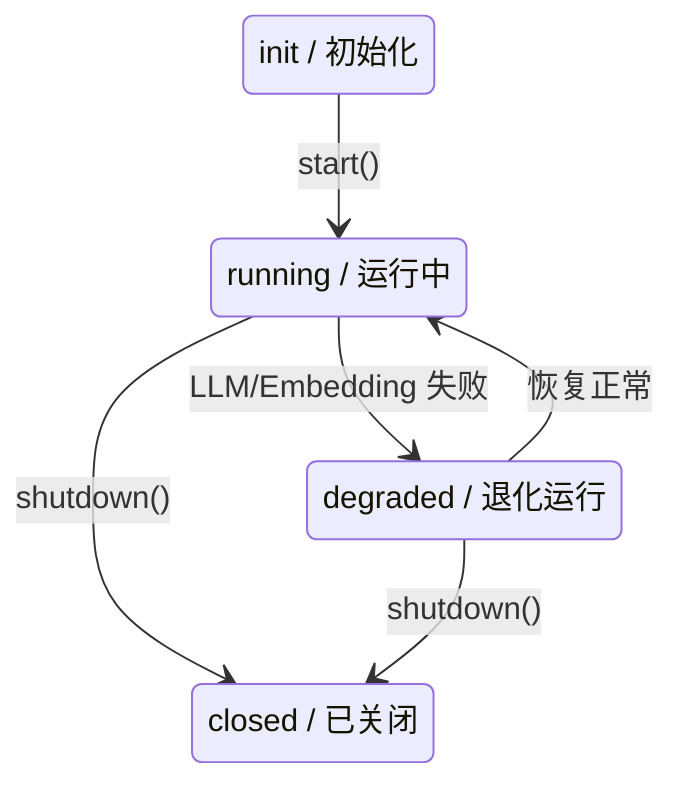

# SylannEngine SDK 规范

版本：`2.3.2`
协议版本：`sylanne.engine.v1`

> **Scope / 定位**：This document is the **SDK API specification** — public interface, output schema, configuration, and lifecycle.
> For the **theoretical computation standard** (axioms, algebra, conformance levels), see [docs/theoretical_spec.md](docs/theoretical_spec.md).
> For a practical **integration walkthrough** (including multi-plugin sharing), see [AGENT_GUIDE.md](AGENT_GUIDE.md).
>
> 本文档是 **SDK API 规范**——公开接口、输出 schema、配置与生命周期。
> 理论计算标准（公理、代数、一致性等级）见 [docs/theoretical_spec.md](docs/theoretical_spec.md)。
> 实用集成指南（含多插件共享）见 [AGENT_GUIDE.md](AGENT_GUIDE.md)。

---

## 1. Overview / 概述

SylannEngine is an affective computation engine SDK.
SylannEngine 是一个情感计算引擎 SDK。

**Positioning / 定位**: Pure computation black-box. Text in, structured data out. No reply generation, no prompt injection, no message routing.
纯计算黑盒。文本输入，结构化数据输出。不生成回复，不注入 prompt，不管消息收发。

---

## 2. Interface Protocol / 接口协议

### 2.0 Installation / 安装方式

Copy `sylanne_core/` into your project, or add it as a git submodule.
直接复制 `sylanne_core/` 目录，或作为 git submodule 引入。

```bash
git submodule add https://github.com/Ayleovelle/SylannEngine.git deps/sylannengine
```

```python
import sys
sys.path.insert(0, "./deps/sylannengine")

from sylanne_core import SylanneEngine, SylanneConfig

engine = SylanneEngine(
    data_dir="./data/sylannengine",
    llm=your_own_llm_callback,  # 自行实现 async (str, str) -> str
    config=SylanneConfig(),
)
await engine.start()
```

The SDK has no framework dependency. / SDK 不依赖任何特定框架。

### 2.1 Engine Initialization / 引擎初始化

```python
from sylanne_core import SylanneEngine

engine = SylanneEngine(
    data_dir: str | Path,                          # 持久化目录（必填）
    llm: Callable[[str, str], Awaitable[str]],     # LLM 回调函数（必填）
    embedding: Callable[[str], Awaitable[list[float]]] | None = None,  # 向量化回调（可选）
    config: SylanneConfig | None = None,           # 配置覆盖（可选）
    *,
    assessor_llm: Callable[[str, str], Awaitable[str]] | None = None,  # 专用评估器 LLM（可选）
)
```

#### Shared Instance / 共享实例

Use `SylanneEngine.shared()` to deduplicate engines by resolved data_dir within
a process — one persistence directory is owned by exactly one engine, avoiding
state splits and lost updates on flush. The guarantee is **per process**: there is
no cross-process lock, so two OS processes on one data_dir would double-flush —
run one process per data_dir.
用 `SylanneEngine.shared()` 按解析后的 data_dir 在进程内去重——一个持久化目录只由一个引擎拥有，避免状态分裂与 flush 丢更新。该保证是**进程内**的：没有跨进程锁，两个进程指向同一 data_dir 会双写，请一个 data_dir 一个进程。

```python
# 同一 data_dir 总是返回同一已启动实例
engine = await SylanneEngine.shared("./data", llm=my_llm)

# 应用关闭时显式释放（flush 落盘；无 atexit 自动刷写）
await SylanneEngine.release_shared("./data")

# 内省：当前进程有哪些共享引擎
SylanneEngine.list_shared()      # [{"data_dir", "status"}, ...]
SylanneEngine.is_shared("./data")  # bool
```

- 多个下游约定同一 data_dir 并统一走 `shared()`，即可复用单一引擎，避免重复计算与重复 LLM 调用（取代前置插件的共享单例职责）。
- 不传 `config` 时引擎自读 `<data_dir>/sylanne.config.json`（见 §7），所有下游共享同一份用户可改配置；首次启动写入默认模板。
- 配置冲突：**显式传入**不同 `config` → 抛 `SharedEngineConflictError`；自读（文件被改 / 跨版本 vendored copy）出现差异 → 仅警告并复用运行中的配置（重启生效），不崩后来者。不同 `llm`/`embedding`/`assessor_llm` → 警告并复用原实例（first-builder-wins）。
- 共享实例 **event-loop 亲和**：仅在首次获取的事件循环内使用，跨 loop 使用抛 `RuntimeError`；不要对共享实例用 `async with`。
- `release_shared()` 之后该实例 `closed`；**不要再用已释放的实例**——共享引擎对已释放实例的再次调用会抛 `RuntimeError`（避免在注册表外复活成第二个引擎、双写丢更新），请重新 `shared()` 获取。
- 直接 `SylanneEngine(...)` 构造不受影响，且不进入共享注册表；但若目标 data_dir 已有活跃共享实例，会记一条 warning 提示重复创建（软提醒，不阻断）。
- 多个 vendored 副本（不同模块名）共存会汇合到同一引擎并去重；若某副本版本与建引擎的副本不一致，会记一条版本串味 warning，建议各副本独立 namespace，或整进程装一份共享依赖。

#### Driver / Observer — 多插件协同（一个引擎，其余监听）

`shared()` 去重的是 **实例**：同一 data_dir 一个进程只有一个引擎。但它不决定 **谁来驱动**——若 N 个插件各自 hook 同一事件、各调 `process()`，实例虽只有一个，计算却跑了 N 次。要"只让一个插件真跑、其余转纯监听"（省资源），用角色层：

```python
# 1) 解析 host 级共享目录，让各自独立的插件落到同一把 key 上真正汇合
data_dir = SylanneEngine.shared_data_dir()          # explicit > $SYLANNE_DATA_DIR > ~/.sylanne/shared

# 2) 强制版：driver 拿完整 engine，observer 拿只读 ObserverView（结构上无法 process）
res = await SylanneEngine.acquire(data_dir, llm=my_llm)
if res.is_driver:
    wire_messages_to(res.engine)                    # 只有 driver 驱动 process()
else:
    res.observer.on(my_listener)                    # 其余只监听 driver 的推送

# 合作版（不强制）：shared() 仍把完整引擎发给所有人，自觉据 role 决定是否驱动
SylanneEngine.role(data_dir)                         # "driver" | "observer" | "unowned"
```

- `shared_data_dir(explicit=None) -> Path`：解析 host 级共享目录（`explicit` > `$SYLANNE_DATA_DIR` > `~/.sylanne/shared`）。不创建目录。各插件不走它就会各用各的目录、永不去重。
- `role(data_dir) -> "driver"|"observer"|"unowned"`：本拷贝的**合作式**角色标签。**不强制**——`shared()` 仍把完整引擎发给所有人，插件需自觉据 role 决定是否 wire `process()`。
- `acquire(data_dir, llm=None, ..., *, as_observer=False) -> AcquireResult`：**强制版**。driver 拿到完整 `engine`；observer 拿到 `ObserverView`（只有 `on/off/state/exists/health`，**没有** `process/tick/inject`，想重复驱动也调不出来）。`result.handle` 给对应句柄、`result.role` 给角色、`result.is_driver` 布尔。建引擎(driver 路径)需 `llm`；`as_observer=True` 给纯监听插件——附到已有 driver，没有则返回 `"unowned"`（稍后重试）。
- 角色按 **(拷贝, data_dir)** 定，且**引擎生命周期内固定**：first-builder = driver，换 driver 靠重启。**无选举、无 handoff**（延续 dumb-rendezvous 决策）。load 顺序决定谁是 driver；必须当 driver 的插件应确保自己先 `acquire`，或其余插件显式 `as_observer=True` 让出。
- observer 经 `view.on(listener)` 收 driver 每次 `process()` 的 `(session_id, surface)` 推送；`view.state(session_id)` 只读不驱动。仅进程内有效（同 `shared()` 的 per-process 保证）。

### 2.2 Core Methods / 核心方法

| Method / 方法 | Signature / 签名 | Description / 说明 |
|--------|-----------|-------------|
| **Lifecycle / 生命周期** |||
| `start` | `async () -> None` | 启动引擎（init -> running） |
| `shutdown` | `async () -> None` | 关闭引擎（刷写所有状态 -> closed） |
| **Shared Instance / 共享实例** |||
| `shared` | `classmethod async (data_dir, llm, embedding=None, config=None, *, assessor_llm=None) -> SylanneEngine` | 取进程内共享实例（按 data_dir 去重，返回已 start 的引擎）；不传 config 时自读 `sylanne.config.json` |
| `release_shared` | `classmethod async (data_dir) -> None` | 关闭并从注册表移除共享实例 |
| `is_shared` | `classmethod (data_dir) -> bool` | 该 data_dir 是否已有活跃共享实例 |
| `list_shared` | `classmethod () -> list[dict]` | 列出当前进程所有共享实例及状态 |
| `clear_shared_registry` | `classmethod () -> None` | 清空共享注册表（不 shutdown；**仅测试隔离用**） |
| `shared_data_dir` | `classmethod (explicit=None) -> Path` | 解析 host 级共享目录（`explicit` > `$SYLANNE_DATA_DIR` > `~/.sylanne/shared`），让独立插件汇合到同一引擎；不创建目录 |
| `role` | `classmethod (data_dir) -> "driver"\|"observer"\|"unowned"` | 本拷贝对该引擎的合作式角色（不强制；first-builder = driver） |
| `acquire` | `classmethod async (data_dir, llm=None, embedding=None, config=None, *, assessor_llm=None, as_observer=False) -> AcquireResult` | 按角色取共享引擎：driver 得完整 `engine`，observer 得只读 `ObserverView`（无法 `process`）；`as_observer=True` 为纯监听附挂 |
| **Session / 会话操作** |||
| `process` | `async (session_id: str, text: str, *, confidence=None, flags=None, now=None, values=None) -> Surface` | 处理输入文本，返回完整计算结果（上下文参数见 §2.3） |
| `tick` | `async (session_id: str, flags: list[str] \| None = None) -> Surface` | 无文本的状态推进（时间衰减、冷却等；flags 默认 `["idle"]`） |
| `state` | `async (session_id: str) -> Surface` | 查询当前状态（不触发计算） |
| `reset` | `async (session_id: str) -> None` | 重置会话状态 |
| `destroy` | `async (session_id: str) -> None` | 销毁会话及持久化数据 |
| `exists` | `(session_id: str) -> bool` | 检查会话是否存在 |
| `inject` | `async (session_id: str, source: str, influence_type: str, intensity: float, target_dimension: str = "", payload: dict \| None = None) -> None` | 向会话热池注入外部影响（见 §2.4） |
| **Events & Health / 事件与健康** |||
| `on` | `(listener: Callable[[str, Surface], Any]) -> None` | 注册推送监听器；每次 `process()` 完成后回调 `listener(session_id, surface)` |
| `off` | `(listener: Callable[[str, Surface], Any]) -> None` | 移除推送监听器 |
| `health` | `() -> HealthStatus` | 引擎级健康检查（不需要 session；见 §4.8） |

### 2.3 Context Parameters / 上下文参数 (`**ctx`)

| Parameter / 参数 | Type / 类型 | Default / 默认值 | Description / 说明 |
|-----------|------|---------|-------------|
| `confidence` | `float \| None` | `None` | 语义置信度 [0, 1]，None 表示由内部 assessor 计算 |
| `flags` | `list[str]` | `[]` | 事件标签（见 3.3 节） |
| `now` | `float` | `time.time()` | 事件时间戳（Unix epoch） |
| `values` | `dict[str, float]` | `{}` | 附加数值信号 |

### 2.4 External Influence Injection / 外部影响注入 (`inject`)

Other plugins or subsystems call `inject()` to affect the emotional state of a session
without going through the full `process()` pipeline. For example, a memory plugin
detecting contradiction with a previously reflected topic can re-ignite that material
in the hot pool.
其他插件或子系统调用 `inject()` 向会话情感状态注入外部影响，无需走完整 `process()` 管线。
例如，记忆插件检测到与此前反思主题的矛盾时，可在热池中重新点燃该素材。

```python
await engine.inject(
    session_id="user_123",
    source="memory_plugin",         # 来源插件标识
    influence_type="contradiction", # 影响类型
    intensity=0.7,                  # 影响强度 [0, 1]
    target_dimension="",            # 热池中的目标维度/材料类型（默认空）
    payload=None,                   # 可选元数据
)
```

**influence_type enum / 影响类型枚举：**

| Value / 值 | Meaning / 含义 |
|-------|---------|
| `contradiction` | 矛盾——与既有情感记忆冲突 |
| `reinforcement` | 强化——增强现有情感模式 |
| `revelation` | 揭示——引入新的情感维度 |
| `betrayal` | 背叛——破坏信任/安全感 |
| `validation` | 确认——肯定现有情感状态 |

---

## 3. Event & Callback Protocol / 事件与回调协议

### 3.1 LLM Callback Signature / LLM 回调签名

```python
async def llm_callback(system_prompt: str, user_prompt: str) -> str:
    """
    Args:
        system_prompt: 系统指令（如 "评估以下文本的情感倾向"）
        user_prompt: 待评估的文本
    Returns:
        LLM 文本响应
    Raises:
        任何异常会被引擎捕获，该次调用退化为本地计算
    """
```

Internal LLM call scenarios / 引擎内部调用 LLM 的场景：
- **Assessor / 语义评估器**：分类标签（positive/negative/boundary/recovery）

### 3.2 Embedding Callback Signature / Embedding 回调签名

```python
async def embedding_callback(text: str) -> list[float]:
    """
    Args:
        text: 待向量化的文本
    Returns:
        浮点向量（维度不限，引擎内部使用余弦相似度）
    Raises:
        失败时退化为关键词匹配召回
    """
```

### 3.3 Event Tag Enum / 事件标签枚举 (flags)

分为 **semantic tags / 语义标签**（描述文本性质）和 **phase tags / 阶段标签**（描述调用时机）。

#### Semantic Tags / 语义标签

| Tag / 标签 | Meaning / 含义 |
|-----|---------|
| `positive` | 正向/安全交互 |
| `negative` | 负向/伤害性内容 |
| `boundary` | 边界触碰 |
| `recovery` | 修复/恢复行为 |
| `idle` | 空闲/无实质内容 |
| `intimate` | 亲密内容 |
| `conflict` | 冲突内容 |
| `farewell` | 告别 |
| `greeting` | 问候 |

#### Phase Tags / 阶段标签

| Tag / 标签 | Meaning / 含义 |
|-----|---------|
| `request` | 用户发来消息 |
| `response` | AI 回复完成 |
| `proactive` | 主动检查 |

Unrecognized tags are silently ignored. / 未识别的标签会被静默忽略。

---

## 4. Output Schema (Surface) / 输出数据格式

### 4.1 Top-Level Structure / 顶层结构

```jsonc
{
    "schema_version": "sylanne.engine.v1",   // 协议版本
    "session_id": "string",                // 会话标识
    "turns": 0,                            // 累计交互轮次
    "timestamp": 1716960000.0,             // 计算时间戳

    "state": { ... },          // 情感状态（8 子系统）
    "personality": { ... },    // 人格状态（双层）
    "decision": { ... },       // 决策输出
    "guard": { ... },          // 边界守卫
    "pad": { ... },            // PAD 情感空间输出（§4.2）
    "pipeline": { ... },       // 7 层管线中间态（diagnostics=True 时返回）
    "dynamics": { ... },       // 动力学指标
    "debug": { ... }           // 调试信息（diagnostics=True 时返回，见 4.9）
}
```

### 4.2 pad — PAD Emotion Space / PAD 情感空间

Pleasure-Arousal-Dominance dimensional output, always present.
三维情感空间输出（愉悦-唤醒-支配），始终返回。

```jsonc
{
    "valence": 0.0,        // [-1, 1] — 愉悦轴（Pleasure axis）
    "arousal": 0.0,        // [0, 1]  — 生理激活度（physiological activation）
    "dominance": 0.0,      // [0, 1]  — 感知控制力（perceived control）
    "label": "neutral",    // 分类情绪标签（categorical emotion label）
    "confidence": 0.0      // [0, 1]  — 分类置信度（classification confidence）
}
```

### 4.3 state — Affective State / 情感状态（8 子系统）

All values in `[0.0, 1.0]` unless noted otherwise. / 所有数值范围 [0.0, 1.0]，除非特别标注。

```jsonc
{
    "rhythm": {                            // 交互节律
        "beat": 0.0,                       // 累计交互计数（单调递增，无上限）
        "stability": 0.5,                  // 节律稳定性
        "strain": 0.0                      // 应激负荷
    },
    "connection": {                        // 连接状态
        "warmth": 0.4,                     // 关系温暖度
        "circulation": 0.0,                // 互动活跃度
        "memory_flow": 0.0                 // 记忆激活强度
    },
    "adaptation": {                        // 适应性
        "plasticity": 0.0,                 // 学习能力
        "sensitivity": 0.0,                // 输入敏感度
        "repetition": 0,                   // 重复次数（整数）
        "threshold_drift": 0.0             // 脱敏漂移
    },
    "responsiveness": {                    // 响应性
        "readiness": 0.2,                  // 行动准备度
        "fatigue": 0.0,                    // 疲劳度
        "trained_reach": 0.0               // 训练容量
    },
    "valence": {                           // 情感效价
        "warmth": 0.45,                    // 情感温暖度
        "volatility": 0.0,                 // 波动性
        "recovery_heat": 0.0               // 恢复能量
    },
    "damage": {                            // 损伤状态
        "open": 0.0,                       // 当前活跃损伤
        "accumulated": 0.0,                // 累积影响
        "sensitivity": 0.0,                // 损伤敏感度
        "recovery": 0.0                    // 恢复进度
    },
    "boundary": {                          // 边界防护
        "pressure": 0.0,                   // 边界压力
        "autonomy": 1.0,                   // 自主权水平
        "interruption_budget": 1.0,        // 主动中断预算
        "cooldown": 0.0,                   // 冷却计时器
        "paused": false                    // 暂停标志（布尔）
    },
    "capacity": {                          // 系统容量
        "load": 0.0,                       // 系统负荷
        "exhaustion": 0.0,                 // 耗竭程度
        "recovery_debt": 0.0              // 恢复欠债
    },
    "needs": {                             // 需求指标
        "expression": 0.0,                 // 表达需求
        "quiet": 0.0,                      // 安静需求
        "recovery": 0.0,                   // 恢复需求
        "contact": 0.0                     // 接触需求
    }
}
```

### 4.4 personality — Personality State / 人格状态

```jsonc
{
    "schema_version": "sylanne.core.personality.v1",

    // Deep structure / 深层结构 — 缓慢漂移，计算驱动
    "deep": {
        "expression_drive": 0.5,           // 表达驱力
        "perception_acuity": 0.5,          // 感知敏锐度
        "boundary_permeability": 0.5,      // 边界渗透性（对新事物的开放度）
        "inner_coherence": 0.5,            // 内在一致性
        "relational_gravity": 0.5          // 关系引力（向他人靠近的倾向）
    },

    // Surface expression / 表层表达 — 快速漂移，文本事件驱动
    "surface": {
        "warmth_bias": 0.5,                // 温暖偏向
        "directness": 0.5,                 // 直接度
        "curiosity": 0.5,                  // 好奇心
        "patience": 0.5,                   // 耐心
        "intimacy_pull": 0.5,              // 亲密倾向
        "autonomy_guard": 0.5             // 自主权保护强度
    }
}
```

### 4.5 decision — Decision Output / 决策输出

```jsonc
{
    "action": "express",                   // 行动类型（枚举）
    "reason": "string",                    // 人类可读的决策原因
    "reason_code": "string",               // 机器可读的原因分类
    "confidence": 0.75,                    // 决策置信度 [0, 1]
    "urgency": 0.3                         // 紧迫度 [0, 1]
}
```

**action enum / 行动枚举：**

| Value / 值 | Meaning / 含义 | Typical Scenario / 典型场景 |
|-------|---------|------------------|
| `express` | 主动表达 | 表达驱力高 |
| `withdraw` | 退缩/沉默 | 负向信号，边界压力高 |
| `recover` | 尝试恢复 | 检测到伤害后 |
| `reach_out` | 主动接触 | 关系引力高 |
| `explore` | 探索/试探 | 好奇心驱动 |
| `hold` | 保持/等待 | 无明确驱力 |
| `guard` | 防御 | 自主权受威胁 |

### 4.6 guard — Boundary Guard / 边界守卫

```jsonc
{
    "allowed": true,                       // 是否允许当前行动
    "reason": "string",                    // 阻止原因（allowed=false 时有值）
    "risk_score": 0.1,                     // 风险评分 [0, 1]
    "constraints": []                      // 当前生效的约束列表
}
```

### 4.7 pipeline — 7-Layer Pipeline State / 7 层管线中间态（可选）

Disabled by default. Enable via `config.diagnostics = True`.
默认关闭，通过 `config.diagnostics = True` 开启。

```jsonc
{
    "L1_encoding": {                       // 第 1 层：超维编码
        "hamming_distance": 0.42,          // 与上次输入的汉明距离
        "novelty": 0.6                     // 新颖度
    },
    "L2_gate": {                           // 第 2 层：预测编码门控
        "path": "normal",                  // 路径：fast / normal / full
        "surprise": 0.35                   // 预测误差
    },
    "L3_absence_impact": {                 // 第 3 层：缺失-影响引擎
        "absence_pressure": 0.2,           // 缺失压力
        "impact_count": 3,                 // 活跃影响数
        "coupling_strength": 0.4           // 耦合强度
    },
    "L4_relational": {                     // 第 4 层：关系动力学
        "coherence": 0.7,                  // 关系一致性
        "active_relations": 2              // 活跃关系数
    },
    "L5_fusion": {                         // 第 5 层：多专家决策融合
        "expert_weights": {},              // 各专家权重
        "consensus": 0.6                   // 共识度
    },
    "L6_boundary": {                       // 第 6 层：自维持边界
        "integrity": 0.9,                  // 边界完整性
        "phase": "stable"                  // 状态：stable / transitioning / breached
    },
    "L7_expression": {                     // 第 7 层：表达触发
        "pressure": 0.4,                   // 表达压力
        "threshold": 0.6,                  // 触发阈值
        "fired": false                     // 本次是否触发
    }
}
```

### 4.8 dynamics — Dynamic Indicators / 动力学指标

```jsonc
{
    "affect": {                            // 情感驱力
        "recovery_drive": 0.0,             // 恢复驱力
        "expression_drive": 0.0,           // 表达驱力
        "quiet_drive": 0.0                 // 安静驱力
    },
    "moral_state": {                       // 道德状态
        "state": "stable",                 // 状态：stable / recovering
        "events": 0                        // 累计事件数
    },
    "uncertainty": {                       // 不确定性
        "claim_caution": 0.0,              // 断言谨慎度 [0, 1]
        "events": 0                        // 累计事件数
    },
    "relational_time": {                   // 关系时间
        "interval_seconds": 0.0,           // 距上次交互的秒数
        "total_duration": 0.0,             // 关系总时长（秒）
        "phase": "active"                  // 阶段：active / cooling / dormant
    },
    "hot_pool": {                          // 热池诊断
        "temperature": 0.0,                // 热池温度
        "volume": 0.0,                     // 热池体积
        "pressure": 0.0,                   // 热池压力
        "material_count": 0,               // 活跃素材数（整数）
        "cascade_active": false,           // 级联是否激活（布尔）
        "cascade_intensity": 0.0,          // 级联强度
        "sensitivity_multiplier": 1.0,     // 敏感度乘数
        "in_recovery": false,              // 是否处于恢复期（布尔）
        "collapse_count": 0                // 崩溃计数（整数）
    }
}
```

### 4.9 debug — Debug Info / 调试信息（diagnostics=True 时返回）

开发者用于判断计算模块是否正常工作。

```jsonc
{
    "healthy": true,                       // 计算引擎是否健康（所有断路器关闭）
    "circuit_breakers": {                  // 各层断路器状态
        "L3_absence_impact": {
            "open": false,                 // 是否断开（true=该层已熔断，使用缓存结果）
            "failures": 0                  // 连续失败次数
        }
    },
    "layer_avg_ms": {                      // 各层平均耗时（毫秒）
        "L1_encoding": 0.12,
        "L3_absence_impact": 1.45
    },
    "computation_cache_size": 5,           // 计算结果缓存条数
    "kernel_schema_version": "sylanne.alpha.body.v1"  // 内核 schema 版本
}
```

**引擎级健康检查**（不需要 session）：

```python
engine.health()
# 返回：
{
    "status": "running",               // 引擎状态：running / degraded / closed
    "active_sessions": 3,              // 当前活跃会话数
    "data_dir_exists": true,           // 持久化目录是否存在
    "llm_configured": true,            // LLM 回调是否已配置
    "embedding_configured": false      // Embedding 回调是否已配置
}
```

---

## 5. Error Handling / 错误处理

### 5.1 Error Codes / 错误码

| Code / 错误码 | Meaning / 含义 | Recoverable / 可恢复 |
|------|---------|-------------|
| `E_SESSION_NOT_FOUND` | 会话不存在 | 是（自动创建） |
| `E_LLM_UNAVAILABLE` | LLM 回调失败 | 是（退化为本地计算） |
| `E_EMBEDDING_UNAVAILABLE` | Embedding 回调失败 | 是（退化为关键词匹配） |
| `E_PERSISTENCE_FAILED` | 持久化写入失败 | 否（状态可能丢失） |
| `E_INVALID_INPUT` | 输入参数不合法 | 是（修正后重试） |
| `E_ENGINE_NOT_INITIALIZED` | 引擎未初始化 | 是（调用 start()） |

### 5.2 Error Response Format / 错误响应格式

```jsonc
{
    "ok": false,
    "error": {
        "code": "E_LLM_UNAVAILABLE",      // 错误码
        "message": "LLM callback raised TimeoutError",  // 错误描述
        "degraded": true                   // true 表示已退化运行，结果仍可用
    },
    // degraded=true 时仍返回计算结果（基于本地计算）
    "state": { ... },
    "decision": { ... }
}
```

### 5.3 Degradation Strategy / 退化策略

The engine is designed to **degrade gracefully** under failure conditions. / 引擎在故障条件下优雅降级。

| Failure / 失败点 | Degradation / 退化行为 |
|---------|-------------|
| LLM assessor unavailable / LLM 评估器不可用 | 使用本地规则引擎评估标签 |
| Persistence failed / 持久化失败 | 内存中继续运行，下次成功时补写 |

---

## 6. Versioning / 版本管理

### 6.1 Semantic Versioning / 语义化版本

SDK follows SemVer: `MAJOR.MINOR.PATCH` / SDK 遵循语义化版本规范。

- **MAJOR**：Surface schema 不兼容变更（字段删除/重命名/类型变更）
- **MINOR**：新增字段、新增方法（向后兼容）
- **PATCH**：Bug 修复、性能优化（行为不变）

### 6.2 Schema Version / Schema 版本

Each output block carries `schema_version`. / 每个输出块携带 schema_version 字段。

Format / 格式：`sylanne.<domain>.<version>`

```python
if surface["schema_version"].startswith("sylanne.engine.v1"):
    # compatible / 兼容
    pass
```

### 6.3 Deprecation Policy / 废弃策略

- 废弃字段至少保留 2 个 MINOR 版本
- 废弃字段标记为 `"_deprecated": true`
- CHANGELOG 中列出迁移路径

---

## 7. Configuration / 配置 (SylanneConfig)

```python
@dataclass
class SylanneConfig:
    mode: Literal["lite", "pro", "max"] = "lite"  # 计算档位
    diagnostics: bool = False          # 是否返回管线中间态
    assessor_enabled: bool = True      # 是否启用 LLM 评估器
    persistence_fsync: bool = True     # 持久化是否 fsync
    tick_drift_cap: float = 0.05       # 单次人格漂移上限
    locale: str = "zh"                 # 语言（影响评估器 prompt）
    force_backend: str | None = None   # 强制计算后端（None / "torch" / "cupy" / "numpy" / "python"）
    training_data_sink: bool = False   # 启用后写本地蒸馏语料（离线 student 训练用）
    training_data_path: str | None = None  # 语料文件名（默认 "distill_corpus.jsonl"）
    training_data_salt: str = ""       # 会话哈希的本地盐（空 = 进程随机盐）
    pel_core_enabled: bool = False     # 启用 PEL-Core 预测编码情感核（v2.5 实验性）
```

### 7.1 Config File / 配置文件

不显式传 `config` 时，引擎自读 `<data_dir>/sylanne.config.json`——所有下游 `shared(data_dir)` 共享同一份用户可改配置（首启写入默认模板，显式传入的 `config=` 优先于文件）。顶层认识的键映射到 `SylanneConfig`，不认识的键忽略；缺失/损坏/取值非法均回退默认、引擎照常启动。配置在建引擎时读取，改动需重启生效。

```jsonc
{
    "mode": "lite",
    "assessor_enabled": true,
    // 可选：把语义评估交给一个小而便宜的模型；不填则用主 llm
    "assessor_model": {
        "api_base": "https://api.deepseek.com/v1",
        "api_key": "${SYLANNE_ASSESSOR_KEY}",   // 建议用环境变量，勿提交密钥
        "model": "deepseek-chat"
    }
}
```

`assessor_model` 块走任意 OpenAI 兼容 `/chat/completions` 接口（纯标准库实现，lite 档零依赖）。也可绕过文件、直接给 `SylanneEngine(...)` / `shared(...)` 传 `assessor_llm`（`async (system, user) -> str`）；二者皆无则评估回落主 `llm`。

---

## 8. Lifecycle / 生命周期



- **init / 初始化**：构造 SylanneEngine，验证参数
- **running / 运行中**：`start()` 后正常运行，LLM/Embedding 可用
- **degraded / 退化运行**：LLM 或 Embedding 不可用，本地回退运行
- **closed / 已关闭**：`shutdown()` 后引擎关闭，所有状态已写入磁盘

```python
await engine.start()       # init → running / 启动引擎
await engine.shutdown()    # → closed / 关闭引擎（刷写所有状态）
engine.status              # "init" | "running" | "degraded" | "closed"
```

---

## 9. Concurrency & Thread Safety / 并发与线程安全

- 同一 `session_id` 的调用自动串行化（内部锁）
- 不同 `session_id` 可并发处理
- `state()` 返回只读快照，不加锁
- 引擎实例线程安全，可在多个 asyncio task 中共享
