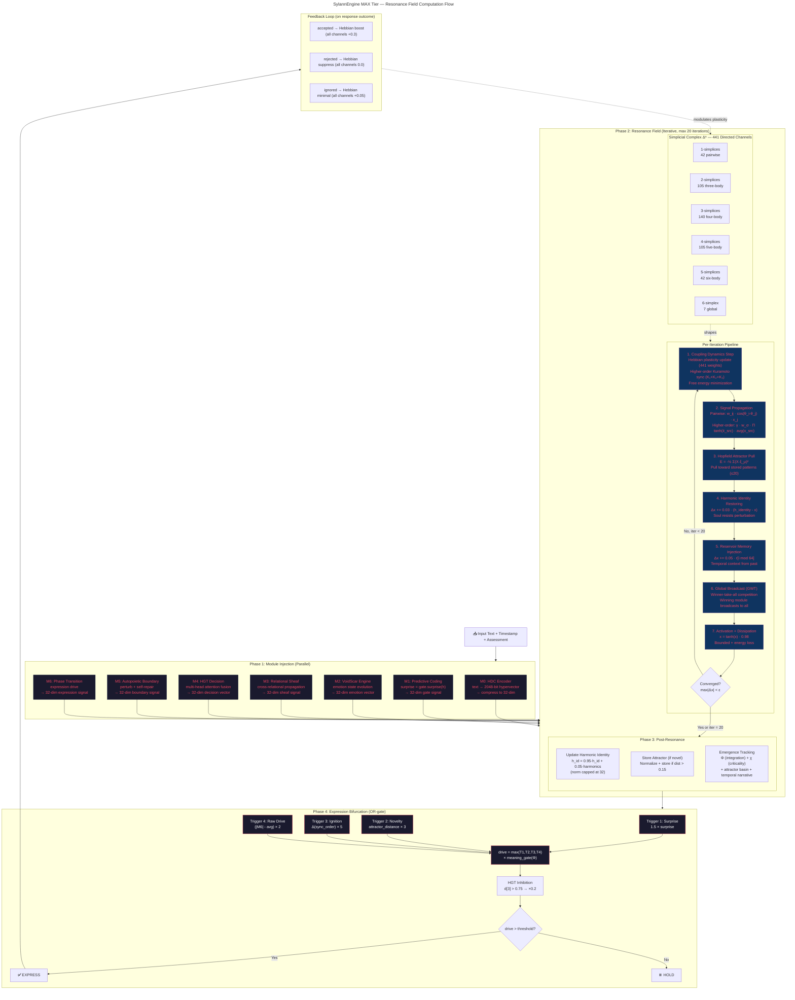

> ⚠️ **Historical document**: This describes the iterative resonance field
> architecture (six mechanisms: Kuramoto phase coupling, Hopfield attractors,
> free-energy minimization, harmonic identity, echo-state reservoir, simplicial
> higher-order coupling) and the GPU/torch path for the `max` tier, both
> removed prior to v2.5 (commit `29b402a`). It is kept for historical reference
> only and does not describe the current engine. For the current architecture,
> see [theoretical_spec.md](theoretical_spec.md) and [SPEC.md](../SPEC.md).



---

## Timing Breakdown (MAX tier, single `process()` call)

```
Phase 1: Module Injection     ~5ms   (7 modules compute in sequence)
Phase 2: Resonance Field     ~40ms   (20 iterations × 441 channels)
  ├─ Coupling dynamics        ~15ms   (Hebbian + Kuramoto + FreeEnergy)
  ├─ Pairwise propagation     ~10ms   (42 channels × 32 dims)
  ├─ Higher-order propagation  ~12ms   (399 channels, AND-gate products)
  ├─ Hopfield + Identity + Reservoir ~2ms
  └─ Activation + convergence  ~1ms
Phase 3: Post-resonance       ~3ms   (harmonics + attractor + emergence)
Phase 4: Expression decision   ~1ms   (OR-gate + threshold)
─────────────────────────────────────
Total                         ~50ms   (CPU, pure Python)
                               <5ms   (GPU, torch batched)
```

## Data Flow Summary

```
Text ──→ [7 Modules] ──inject──→ [Resonance Field: 224-dim state]
                                         │
                                    ┌────┴────┐
                                    │ 20 iter │ ← 441 channels × Hebbian weights
                                    │ converge│ ← Kuramoto phase sync
                                    │         │ ← Hopfield attractors (≤20)
                                    │         │ ← Harmonic identity (soul)
                                    │         │ ← Echo reservoir (memory)
                                    └────┬────┘
                                         │
                              ┌──────────┼──────────┐
                              ▼          ▼          ▼
                         Expression   Emergence   Plasticity
                         (bifurcation) (Φ, χ)    (use→strengthen)
```
